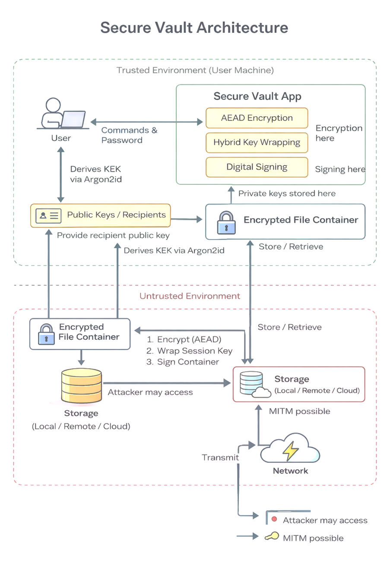

# Boveda Digital Segura de Documentos (Secure Digital Document Vault)

## ¿Qué es?

Es una aplicación de línea de comandos diseñada para proteger documentos sensibles mediante criptografía moderna. Permite cifrar, firmar y compartir archivos de manera segura sin depender de herramientas tradicionales como el correo electrónico o almacenamiento en la nube, que no ofrecen garantías criptográficas sólidas.

## ¿Qué problema resuelve?

Las herramientas convencionales para compartir archivos no garantizan:

- Confidencialidad del contenido

- Integridad del archivo

- Autenticidad del remitente

Este sistema aborda estos tres aspectos mediante mecanismos criptográficos formales.

## Funcionalidades Principales

| Operacion | Descripcion |
|---|---|
| **Cifrar** | Protege el archivo con cifrado autenticado (AEAD) usando AES-GCM o ChaCha20-Poly1305 |
| **Compartir** | Manda el archivo cifrado a alguien especifico usando cifrado hibrido (clave simetrica por archivo + clave publica del destinatario) |
| **Verificar** | Firma digitalmente el archivo con Ed25519 o RSA-PSS para comprobar quien lo mando y que no fue alterado |
| **Gestionar claves** | Las claves privadas se guardan cifradas en un Key Store protegido con Argon2id. Nunca en texto plano |

## Primitivas criptograficas

| Funcion | Algoritmo |
|---|---|
| Cifrado simetrico (AEAD) | AES-256-GCM o ChaCha20-Poly1305 |
| Cifrado asimetrico | RSA-OAEP / X25519 ECDH |
| Firmas digitales | Ed25519 / RSA-PSS |
| Derivacion de claves (KDF) | Argon2id / PBKDF2 |
| Aleatoriedad | CSPRNG (os.urandom) |

## Stack tecnologico

| Componente | Tecnologia |
|---|---|
| Lenguaje | Python 3.10+ |
| Libreria criptografica | cryptography (pyca) |
| Formato | CLI / Aplicacion de escritorio |

## Descripción General 

### Problema
Proteger documentos sensibles garantizando:

- Confidencialidad

- Integridad

- Autenticidad

- No repudio
  
### Funciones Principales
- Cifrado autenticado (AEAD)

- Cifrado híbrido para compartición

- Firma digital

- Gestión segura de claves privadas

### Fuera de alcance
- Protección contra malware o keyloggers

- Anonimato o protección de metadatos de tráfico

- Alta disponibilidad o almacenamiento distribuido

- Identidad federada (OAuth, SSO)

- Sistema de mensajería en tiempo real
- 
## Diagrama de Arquitectura 

- Solo la Secure Vault Application y el Encrypted Key Store son confiables.

- Todo almacenamiento, red y contenedores cifrados se consideran no confiables.

- La seguridad se garantiza criptográficamente, no mediante confianza en infraestructura.

## Requerimientos de Seguridad
**RS-1 – Confidencialidad del contenido**

Un atacante que obtenga el contenedor cifrado no debe poder recuperar el texto plano sin la clave privada correspondiente.

**RS-2 – Integridad del contenido**

Cualquier modificación del contenedor debe detectarse mediante verificación de tag AEAD.

**RS-3 – Autenticidad del remitente**

Solo quien posea la clave privada puede generar una firma válida verificable.

**RS-4 – Confidencialidad de claves privadas**

Las claves privadas nunca se almacenan en texto plano y se protegen mediante KEK derivada con Argon2id.

**RS-5 – Protección contra manipulación**

El sistema debe detectar alteraciones en metadatos, clave envuelta, tag o firma.

**RS-6 – Unicidad de nonce**

Cada operación usa nonce único de 96 bits generado por CSPRNG.

**RS-7 – Gestión automatizada de claves**

El sistema debe generar y encapsular claves automáticamente, evitando manejo manual.

## Modelo de Amenaza

### Activos

- Contenido de archivos

- Metadatos

-  Claves privadas

- Contraseñas

- Firmas digitales

- Nonces

### Adversarios
**ADV-1 – Atacante externo con acceso a almacenamiento**

- Puede leer, copiar y modificar contenedores.

- No puede romper AES-256 ni Ed25519.

**ADV-2 – Destinatario malicioso**

- Puede leer su archivo.

- No puede falsificar firma del remitente.

**ADV-3 – Man-in-the-Middle**

- Puede interceptar y sustituir claves públicas.

- No puede descifrar sin claves privadas.

**ADV-4 – Acceso físico temporal**

- Puede copiar el Encrypted Key Store.

- No puede descifrarlo sin contraseña.

### Supuestos de Confianza
- Usuarios eligen contraseñas fuertes.

- Las claves públicas son auténticas.

- El SO provee CSPRNG seguro.

- El almacenamiento es no confiable.

- La aplicación no ha sido modificada.

- No hay malware durante el uso.

### Review de la Superficie de Ataque

| Punto de entrada               | Riesgo                | Requisito afectado |
| ------------------------------ | --------------------- | ------------------ |
| Generación de nonce            | Reutilización         | RS-1, RS-2         |
| Encrypted Key Store            | Fuerza bruta          | RS-4               |
| Importación de claves públicas | MitM                  | RS-3               |
| Entrada de archivos            | DoS / Path traversal  | RS-1               |
| Entrada de contraseña          | Exposición en memoria | RS-4               |
| Verificación de firma          | Orden incorrecto      | RS-3               |

### Reestricciones de Diseño derivadas de los Requisitos
| Requisito              | Decisión de diseño                 |
| ---------------------- | ---------------------------------- |
| Confidencialidad       | Uso obligatorio de AEAD            |
| Integridad             | Metadatos vinculados como AAD      |
| Autenticidad           | Implementación de firmas digitales |
| Protección de claves   | Uso de Argon2id para KEK           |
| No repetición de nonce | CSPRNG + clave por archivo         |
| Gestión automatizada   | Key wrapping híbrido automático    |

## Equipo

| Nombre | GitHub |
|---|---|
| Barrios Aguilar Dulce Michelle | @milliyx |
| Contreras Colmenero Emilio Sebastian | @SEBASTIANCONTRERAS35 |
| Martinez Lopez Evan Emiliano | @EvanEmi |
| Pulido Vazquez Rodrigo | @rothd123 |

## Referencias

- Ferguson, Schneier, Kohno. *Cryptography Engineering*. Wiley.
- RFC 4107 / BCP 107: Guidelines for Cryptographic Key Management.
- BCP 86 / RFC 4086: Randomness Requirements for Security.
- Menezes, van Oorschot, Vanstone. *Handbook of Applied Cryptography*. CRC Press.