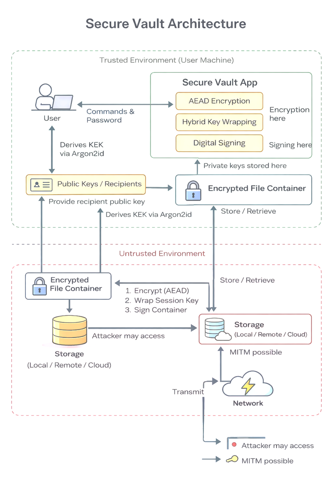

# Bóveda Digital Segura de Documentos (SDDV)

**Equipo:** Barrios Aguilar Dulce Michelle · Contreras Colmenero Emilio Sebastian · Martínez López Evan Emiliano · Caballero Martínez Sergio Jair  
**Materia:** Criptografía — Dra. Rocío Aldeco Pérez · UNAM 2026-2

---

## ¿Qué es?

Una aplicación para proteger documentos sensibles mediante criptografía moderna. Permite cifrar, firmar y compartir archivos de manera segura sin depender de herramientas tradicionales como el correo electrónico o almacenamiento en la nube, que no ofrecen garantías criptográficas sólidas.

SDDV se distribuye en **dos formas equivalentes**:

- **CLI Python** — `python -m crypto`, ejecutable en cualquier máquina con Python ≥ 3.10.
- **Frontend web** — versión navegador 100% local construida con Pyodide. **Demo en vivo:** [`sergiocaballeroo.github.io/Cryptography`](https://sergiocaballeroo.github.io/Cryptography/). Sin servidores, sin cuentas: las llaves privadas literalmente nunca dejan el navegador del usuario.

## ¿Qué problema resuelve?

Las herramientas convencionales para compartir archivos no garantizan:

- Confidencialidad del contenido
- Integridad del archivo
- Autenticidad del remitente

Este sistema aborda los tres aspectos mediante mecanismos criptográficos formales.

## Garantías de seguridad

- **Confidencialidad** — AES-256-GCM / ChaCha20-Poly1305 (AEAD) — *D2*
- **Integridad** — tag de 128 bits cubre ciphertext y metadatos — *D2*
- **Compartición segura** — cifrado híbrido multi-destinatario (X25519 ECDH + KEM+DEM) — *D3*
- **Autenticación de origen** — firmas Ed25519 sobre contenedores híbridos completos, patrón verify-first — *D5*
- **Detección de re-empaquetado** — binding del fingerprint del firmante a los datos firmados — *D5*
- **Gestión segura de llaves privadas** — keystore con scrypt + AES-256-GCM, ciclo de vida completo (init/rotate/revoke/backup) — *D6*

---

## Estructura del proyecto

```
Proyecto/
├── crypto/
│   ├── aead.py              # D2 — Cifrado AEAD (AES-256-GCM, ChaCha20-Poly1305)
│   ├── keys.py              # Gestión de llaves Ed25519 (PKCS8 PEM) — API legacy
│   ├── signatures.py        # Firmas Ed25519 + wrappers para SDDH (D5)
│   ├── hybrid.py            # D3 — Cifrado híbrido multi-destinatario (X25519)
│   ├── secure_send.py       # D5 — API combinada Encrypt+Sign / Verify+Decrypt
│   ├── kdf.py               # D6 — KDF scrypt (memory-hard) con parámetros OWASP
│   ├── keystore_format.py   # D6 — Esquema JSON v1 + envelope AES-256-GCM
│   ├── keystore.py          # D6 — KeyStore API (init/unlock/rotate/revoke/...)
│   ├── keystore_backup.py   # D6 — export_backup / import_backup
│   └── __main__.py          # D6 — CLI (python -m crypto <subcomando>)
├── tests/
│   ├── test_aead.py                 # 27 tests — módulo AEAD
│   ├── test_keys.py                 # 19 tests — gestión de llaves legacy
│   ├── test_signatures.py           # 17 tests — firmas digitales (SDDV)
│   ├── test_hybrid.py               # 31 tests — cifrado híbrido
│   ├── test_d5_hybrid_signed.py     # 28 tests — D5 firma sobre SDDH
│   ├── test_security_patches.py     # 45 tests — parches VULN-001..007
│   ├── test_kdf.py                  # 24 tests — D6 KDF (scrypt)
│   ├── test_keystore_format.py      # 33 tests — D6 envelope + esquema v1
│   ├── test_keystore.py             # 37 tests — D6 API básica
│   ├── test_keystore_lifecycle.py   # 21 tests — D6 rotate/revoke/change-pwd/expir
│   └── test_keystore_security.py    # 20 tests — D6 rúbrica (stolen, modified, etc.)
├── web/
│   ├── README.md                    # Guía del frontend
│   ├── dev-server.py                # Servidor estático local (puerto 5500)
│   └── frontend/
│       ├── index.html               # UI vanilla HTML
│       ├── styles.css               # Tema dark + acento verde menta
│       ├── app.js                   # Bridge JS ↔ Python (Pyodide)
│       ├── pyodide-runtime.js       # Bootstrap Pyodide + IDBFS keystore
│       └── sddv_api.py              # Adapter Python que expone crypto/ al navegador
├── docs/
│   ├── architecture.svg             # Diagrama de arquitectura
│   ├── D1_Threat_Model.md           # D1 — Modelo de amenazas consolidado
│   ├── D2_Encryption_Design.md      # D2 — Cifrado AEAD
│   ├── D5_Signature_Design.md       # D5 — Firmas Ed25519
│   ├── D6_Key_Management.md         # D6 — Diseño del keystore y ciclo de vida
│   ├── security_audit_report.md     # D4 — Auditoría de manipulación
│   └── vulnerability_report.md      # Reporte de VULN-001..007
├── demo.py                  # Demo D2 + D3 + D5
├── demo_d6.py               # Demo del ciclo de vida D6 (keystore)
├── requirements.txt
└── README.md
```

---

## Diagrama de arquitectura



- Solo la *Secure Vault Application* y el *Encrypted Key Store* son confiables.
- Todo almacenamiento, red y contenedores cifrados se consideran no confiables.
- La seguridad se garantiza criptográficamente, no mediante confianza en infraestructura.

---

## Requerimientos de seguridad

| ID | Requerimiento | Cómo se cumple |
|---|---|---|
| **RS-1** | Confidencialidad del contenido — un atacante con el contenedor cifrado no debe poder recuperar el plaintext sin la clave | AES-256-GCM / ChaCha20-Poly1305, clave de 256 bits, nonce CSPRNG por mensaje |
| **RS-2** | Integridad del contenido — cualquier modificación al contenedor debe detectarse | Tag AEAD de 128 bits cubre ciphertext + AAD (metadatos) |
| **RS-3** | Autenticidad del remitente — solo el dueño de la llave privada puede generar firma válida | Firma Ed25519 (RFC 8032), EUF-CMA seguro |
| **RS-4** | Confidencialidad de claves privadas — nunca en texto plano | Keystore D6: scrypt (n=2¹⁵, r=8, p=1) + AES-256-GCM por identidad; PEM PKCS8 legacy disponible |
| **RS-5** | Protección contra manipulación — alteraciones en metadatos, llave envuelta, tag o firma deben detectarse | Cabecera completa como AAD del DEM + firma Ed25519 sobre contenedor SDDH completo |
| **RS-6** | Unicidad de nonce — cada operación usa nonce único de 96 bits | `os.urandom(12)` por cifrado; tests verifican unicidad estadística |
| **RS-7** | Gestión del ciclo de vida de llaves | D6 KeyStore: `init / unlock / change_password / rotate / revoke / backup / restore` |

---

## Modelo de amenaza

> El modelo completo y consolidado vive en
> **[`docs/D1_Threat_Model.md`](docs/D1_Threat_Model.md)**, incluida la
> sección 6 que cubre los escenarios específicos de D6 (robo del
> keystore, password débil, dispositivo comprometido). Esta sección es
> un resumen.

### Activos protegidos

- Contenido de archivos
- Metadatos (filename, timestamp, lista de destinatarios)
- Claves privadas (Ed25519 firmante, X25519 destinatario)
- Contraseñas (de protección de PEM)
- Firmas digitales
- Nonces

### Adversarios

| ID | Adversario | Capacidades | Limitaciones |
|---|---|---|---|
| **ADV-1** | Atacante externo con acceso a almacenamiento | Lee, copia y modifica contenedores | No puede romper AES-256 ni Ed25519 |
| **ADV-2** | Destinatario malicioso | Lee su archivo legítimamente | No puede falsificar firma del remitente |
| **ADV-3** | Man-in-the-Middle | Intercepta y sustituye claves públicas | No puede descifrar sin claves privadas |
| **ADV-4** | Acceso físico temporal | Copia el Encrypted Key Store | No puede descifrarlo sin la contraseña |

### Supuestos de confianza

- Los usuarios eligen contraseñas fuertes.
- Las claves públicas distribuidas son auténticas (canal de distribución fuera de scope).
- El SO provee CSPRNG seguro (`/dev/urandom` en Linux/macOS, `BCryptGenRandom` en Windows).
- El almacenamiento es no confiable.
- La aplicación no ha sido modificada.
- No hay malware durante el uso.

### Superficie de ataque

| Punto de entrada | Riesgo | Requisito afectado |
|---|---|---|
| Generación de nonce | Reutilización catastrófica en GCM | RS-1, RS-2 |
| Encrypted Key Store | Fuerza bruta sobre password | RS-4 |
| Importación de claves públicas | MitM en distribución | RS-3 |
| Entrada de archivos | DoS / Path traversal | RS-1 |
| Entrada de contraseña | Exposición en memoria | RS-4 |
| Verificación de firma | Orden incorrecto (decrypt antes de verify) | RS-3 — mitigado por API combinada `secure_verify_and_decrypt` |

### Restricciones de diseño derivadas

| Requisito | Decisión de diseño |
|---|---|
| Confidencialidad | Uso obligatorio de AEAD |
| Integridad | Metadatos vinculados como AAD |
| Autenticidad | Firmas Ed25519 sobre contenedor completo |
| Protección de claves | PKCS8 PEM cifrado (compatible con OpenSSL) |
| No repetición de nonce | CSPRNG + clave fresca por archivo |
| Gestión automatizada | Key wrapping híbrido automático (KEM+DEM) |

---

## Instalación

```bash
# Clonar el repositorio
git clone git@github.com:sergiocaballeroo/Cryptography.git
cd Cryptography

# Instalar dependencias (cryptography>=41, pytest>=7)
pip install -r requirements.txt
```

---

## Ejecutar tests

```bash
# Toda la suite (300 tests: D2 + D3 + D5 + VULN + D6)
pytest tests/ -v

# Solo D6 (135 tests)
pytest tests/test_kdf.py tests/test_keystore_format.py \
       tests/test_keystore.py tests/test_keystore_lifecycle.py \
       tests/test_keystore_security.py -v

# Solo los 5 tests rúbrica D6
pytest tests/test_keystore_security.py -v

# Por módulo individual
pytest tests/test_aead.py -v
pytest tests/test_keys.py -v
pytest tests/test_signatures.py -v
pytest tests/test_hybrid.py -v
pytest tests/test_d5_hybrid_signed.py -v
pytest tests/test_security_patches.py -v
```

---

## Demo en vivo

```bash
# Demo D2 + D3 + D5
python demo.py

# Demo D6 (ciclo de vida del keystore)
python demo_d6.py
```

`demo.py` ejecuta los 5 escenarios automáticamente:

| # | Escenario | Resultado esperado |
|---|-----------|-------------------|
| 1 | Cifrado válido → descifrado | ✔ Plaintext recuperado idéntico |
| 2 | Compartido → ambos destinatarios descifran | ✔ Alice y Bob obtienen el mismo documento |
| 3 | No-destinatario intenta descifrar | ✔ `ValueError: no está autorizado` |
| 4 | Archivo modificado → descifrado falla | ✔ `InvalidTag` en 3 variantes de ataque |
| 5 | **D5 — Firmar + cifrar + verify-first + descifrar** | ✔ Bob/Carol descifran tras verificar; rechazo de re-firmado, metadata modificada y firma eliminada |

`demo_d6.py` recorre el ciclo completo del key management:

| # | Escenario | Resultado |
|---|---|---|
| 1 | Crear identidades para Alice y Bob | ✔ `keystore/alice.json` y `bob.json` |
| 2 | Inspeccionar el JSON del keystore | ✔ privada cifrada, salt/n/r/p visibles |
| 3 | Unlock con password incorrecto | ✔ `InvalidTag` (rúbrica: wrong password → denied) |
| 4 | Alice firma+cifra documento para Bob | ✔ contenedor SDDH firmado |
| 5 | Bob verifica y descifra desde su keystore | ✔ plaintext recuperado |
| 6 | Rotación de las llaves de Alice | ✔ nuevo fingerprint; archivo `.rotated-<ts>.json` |
| 7 | Backup → borrar → restore | ✔ identidad restaurada con password independiente |

---

## Frontend web (Pyodide)

SDDV cuenta con una **versión web** que ejecuta toda la criptografía
dentro del navegador del usuario mediante [Pyodide](https://pyodide.org)
(CPython compilado a WebAssembly). El frontend reutiliza **el mismo
código `crypto/`** que el CLI; no hay reimplementación en JavaScript.

### Características clave

- **Zero-server.** No hay backend ni base de datos. Las llaves privadas
  viven en `IndexedDB` del navegador y nunca cruzan la red.
- **Mismo código auditado.** Los módulos `crypto/aead.py`,
  `crypto/hybrid.py`, `crypto/keystore.py`, etc. se descargan en
  Pyodide y se ejecutan ahí — los mismos 300 tests del backend cubren
  la lógica criptográfica del navegador.
- **Persistencia transparente.** `IDBFS` monta `IndexedDB` en
  `/keystore` dentro del filesystem virtual de Pyodide. Cierras la
  pestaña, vuelves, las identidades siguen ahí.
- **Demo en vivo.** Publicado vía GitHub Pages en
  [`sergiocaballeroo.github.io/Cryptography`](https://sergiocaballeroo.github.io/Cryptography/).

### Cómo correr localmente

```bash
# Desde la raíz del repo
python web/dev-server.py
# → http://localhost:5500
```

El servidor de desarrollo mapea `/crypto/*` al módulo del repo y todo
lo demás al directorio `web/frontend/`. Cero dependencias npm.

### Limitaciones conocidas (documentadas en `web/README.md`)

- **scrypt bloquea el main thread** ~0.5–1.5 s por operación
  (no hay Web Worker todavía).
- **iOS Safari** puede agotar memoria por pestaña en archivos grandes.
- Sin tests automatizados del frontend; la compatibilidad CLI↔web es
  "por construcción" (mismo `.py`), no probada por tests dedicados.

### Modelo de amenaza del frontend

El frontend **mantiene** las propiedades criptográficas del backend
(verify-first, AAD, nonce uniqueness) pero **amplifica ADV-6**
(dispositivo comprometido): un navegador es una superficie mucho
mayor que un CLI nativo — extensiones, DevTools, BHO. Esto está
declarado como trade-off explícito en `web/README.md`.

---

## Uso de la API

### D2 — Cifrado simétrico (archivo individual)

```python
from crypto.aead import encrypt_file, decrypt_file, Algorithm

# Cifrar
with open("documento.pdf", "rb") as f:
    plaintext = f.read()

container, key = encrypt_file(plaintext, "documento.pdf", algo=Algorithm.AES_256_GCM)

with open("documento.pdf.sddv", "wb") as f:
    f.write(container)

# Descifrar
with open("documento.pdf.sddv", "rb") as f:
    container = f.read()

plaintext, metadata = decrypt_file(container, key)
print(f"Archivo: {metadata['filename']}")
```

### D3 — Cifrado híbrido multi-destinatario

```python
from crypto.hybrid import (
    generate_x25519_keypair,
    encrypt_for_recipients,
    decrypt_for_recipient,
    get_recipient_fingerprints,
)

# Generar llaves para Alice y Bob
alice_priv, alice_pub = generate_x25519_keypair()
bob_priv,   bob_pub   = generate_x25519_keypair()

# Cifrar para ambos
container = encrypt_for_recipients(plaintext, "documento.pdf", [alice_pub, bob_pub])

# Cualquiera de los dos puede descifrar
plaintext_alice, meta = decrypt_for_recipient(container, alice_priv)
plaintext_bob,   meta = decrypt_for_recipient(container, bob_priv)

# Ver destinatarios autorizados (sin necesidad de llave)
fps = get_recipient_fingerprints(container)
print(f"Destinatarios: {fps}")
```

### Firmas digitales sobre contenedores SDDV (Encrypt-then-Sign)

```python
from crypto.keys import generate_keypair
from crypto.signatures import sign_container, verify_container
from crypto.aead import encrypt_file, decrypt_file

priv, pub = generate_keypair()

# 1. Cifrar
container, key = encrypt_file(plaintext, "doc.pdf")

# 2. Firmar el contenedor cifrado
signed = sign_container(container, priv)

# 3. Verificar ANTES de descifrar
container_verificado = verify_container(signed, pub)

# 4. Descifrar solo si la firma es válida
plaintext, meta = decrypt_file(container_verificado, key)
```

### D5 — Cifrado híbrido + firma (API combinada, recomendado)

```python
from crypto.secure_send import secure_encrypt_and_sign, secure_verify_and_decrypt
from crypto.keys import generate_keypair                  # Ed25519 firmante
from crypto.hybrid import generate_x25519_keypair         # X25519 destinatarios

# Llaves
alice_sign_priv, alice_sign_pub = generate_keypair()
bob_priv, bob_pub               = generate_x25519_keypair()
carol_priv, carol_pub           = generate_x25519_keypair()

# Envío: Alice cifra para Bob y Carol, firma con su llave Ed25519
signed_container = secure_encrypt_and_sign(
    plaintext=b"Documento confidencial...",
    filename="contrato.pdf",
    recipients=[bob_pub, carol_pub],
    signer_priv=alice_sign_priv,
)

# Recepción: Bob verifica que sea de Alice y descifra. Si no es de Alice
# o el contenedor fue modificado, lanza InvalidSignature ANTES de descifrar.
plaintext, metadata = secure_verify_and_decrypt(
    signed_container,
    expected_signer_pub=alice_sign_pub,
    recipient_priv=bob_priv,
)
```

La función combinada hace que sea **imposible saltarse la verificación**: si la firma falla, no se llega a la fase de descifrado. Es el patrón "misuse-resistant API" recomendado por NaCl/libsodium.

### D6 — KeyStore (gestión de llaves privadas)

El keystore D6 reemplaza el patrón "generar par + guardar PEM cifrado"
por una capa que protege las llaves privadas con un KDF explícito
(scrypt) y soporta el ciclo de vida completo. La API legacy de
`crypto/keys.py` sigue disponible para compatibilidad.

**CLI** — todas las contraseñas se piden con `getpass` para que no
aparezcan en historiales de shell ni en `ps`:

```bash
# Crear identidad (genera Ed25519 + X25519; cifra con scrypt+AES-GCM)
python -m crypto init alice

# Listar identidades del keystore
python -m crypto list

# Ver fingerprints (sin necesidad de password)
python -m crypto fingerprint alice

# Cambiar password (re-cifra con nuevo salt y nonce; mismas llaves)
python -m crypto change-password alice

# Rotar llaves (genera par nuevo, archiva el viejo)
python -m crypto rotate alice

# Revocar (bloquea unlocks pero deja la pública consultable)
python -m crypto revoke alice --reason "key compromise"

# Backup con password independiente del operativo
python -m crypto backup alice ./backups/alice.sddv_backup

# Restaurar desde backup
python -m crypto restore ./backups/alice.sddv_backup --name alice_restored

# Borrar (exige password correcto como prueba de autoría)
python -m crypto delete alice

# Override del directorio
python -m crypto --keystore ./otro_dir list
```

**API Python — flujo D5 desde el keystore (recomendado):**

```python
from crypto.keystore import KeyStore
from crypto.secure_send import (
    encrypt_and_sign_from_keystore,
    verify_and_decrypt_from_keystore,
)

ks = KeyStore("keystore")
ks.init_identity("alice", "passwordFuerte_2026!")
ks.init_identity("bob",   "otroPasswordFuerte_2026!")

# Envío
bob_pub_x25519 = ks.get_public_keys("bob")["x25519_pub"]
container = encrypt_and_sign_from_keystore(
    ks, "alice", "passwordFuerte_2026!",
    plaintext=b"Documento confidencial...",
    filename="contrato.pdf",
    recipients_x25519=[bob_pub_x25519],
)

# Recepción
alice_pub_ed = ks.get_public_keys("alice")["ed25519_pub"]
plaintext, metadata = verify_and_decrypt_from_keystore(
    ks, "bob", "otroPasswordFuerte_2026!",
    signed_container=container,
    expected_signer_pub=alice_pub_ed,
)
```

**Backup y recuperación:**

```python
from crypto.keystore_backup import export_backup, import_backup

# Backup con password independiente
export_backup(
    ks, "alice",
    active_password="passwordFuerte_2026!",
    backup_password="passwordDelBackup_2026!",
    out_path="alice.sddv_backup",
)

# Restore
info = import_backup(
    ks, "alice.sddv_backup",
    backup_password="passwordDelBackup_2026!",
    new_active_password="passwordRestaurado_2026!",
    name="alice_restaurada",   # opcional: renombrar al restaurar
)
```

**Documentación completa:** [`docs/D6_Key_Management.md`](docs/D6_Key_Management.md)
incluye el formato JSON v1, los parámetros scrypt, el ciclo de vida y
la alineación con el modelo de amenazas.

---

## Formato de contenedores

### SDDV (D2 — cifrado simétrico)
```
MAGIC(4)      b"SDDV"
VERSION(1)    = 1
ALGO_ID(1)    0x01=AES-256-GCM  0x02=ChaCha20-Poly1305
TIMESTAMP(8)  Unix time (big-endian uint64)
FNAME_LEN(2)  longitud del nombre (big-endian uint16)
FILENAME      variable, UTF-8         ← todo lo anterior es el AAD
NONCE(12)     aleatorio CSPRNG
CT_LEN(4)     longitud del ciphertext
CIPHERTEXT    variable
TAG(16)       tag de autenticación AEAD
```

### SDDH (D3 — cifrado híbrido)
```
MAGIC(4)          b"SDDH"
VERSION(1)        = 1
ALGO_ID(1)
TIMESTAMP(8)
FNAME_LEN(2) + FILENAME
RCPT_COUNT(2)     número de destinatarios
Por cada destinatario (124 bytes fijos):
  FINGERPRINT(32)   SHA-256 de la X25519 pub key del destinatario
  EPH_PUB(32)       X25519 ephemeral public key
  WRAP_NONCE(12)    nonce para el AES-GCM de envolvimiento
  WRAPPED_KEY(48)   file_key cifrada: ct(32) + tag(16)   ← todo lo anterior es el AAD
NONCE(12)
CT_LEN(4) + CIPHERTEXT
TAG(16)
```

### SDDH firmado (D5 — autenticación de origen)
```
[ contenedor SDDH completo, tal como D3 ]    ← cubierto por la firma
SIGN_MAGIC(4)     b"SIGS"                    ← cubierto por la firma
SIGNER_FP(32)     SHA-256(raw Ed25519 pub)   ← cubierto por la firma
SIGNATURE(64)     Ed25519 sobre TODO lo anterior
```

**Garantías del footer de firma:**
- Cubre el SDDH **completo** (metadatos, lista de destinatarios, ciphertext, tag AEAD).
- El `SIGNER_FP` está **incluido** en lo firmado, por lo que un atacante no puede sustituir la identidad del firmante manteniendo la firma válida.
- Verificación con `Ed25519PublicKey.verify(sig, SDDH || b"SIGS" || fp)`. Si falla → `InvalidSignature`.

---

## Decisiones de diseño criptográfico

| Decisión | Elección | Justificación |
|----------|----------|---------------|
| Cifrado simétrico | AES-256-GCM | AEAD nativo, hardware-accelerated, estándar NIST |
| Alternativa | ChaCha20-Poly1305 | Resistente a timing attacks, sin instrucciones AES |
| Nonce | 96-bit CSPRNG | Probabilidad de colisión ≈ 2⁻³² tras 2³² mensajes |
| AAD | Cabecera completa | Cualquier modificación a metadatos invalida el TAG |
| Firma | Ed25519 | 128-bit seguridad, 64-byte sig, determinista (RFC 8032) |
| Patrón | Encrypt-then-Sign | Verificación antes de descifrar — no expone plaintext |
| Datos firmados | SDDH completo + magic + fingerprint | Cubre metadata, recipients, ciphertext, tag; binding de identidad |
| Identificación firmante | SHA-256(raw pubkey Ed25519) | 32 bytes, coherente con D3, sin PKI |
| Encoding firma | 64 bytes raw (RFC 8032) | Sin base64; el contenedor ya es binario |
| KEM | X25519 ECDH + HKDF | Ephemeral keys por destinatario → forward secrecy |
| KDF de wrapping | HKDF-SHA256 | Salt = fingerprint del destinatario, info = "SDDV-D3-wrap" |
| Protección llave priv (legacy) | PKCS8 PEM (AES-256-CBC) | Estándar compatible con OpenSSL |
| Protección llave priv (D6) | scrypt (n=2¹⁵, r=8, p=1) + AES-256-GCM | Memory-hard (resistente GPU/ASIC); AEAD autenticado |
| Formato del keystore | JSON v1 con `encrypted_private_key`, `salt`, `kdf_parameters`, `metadata` | Estructurado, autodocumentado, fácil de migrar a v2 |
| Backup | Re-cifrado con password independiente | Defense-in-depth: separa el secreto operativo del de respaldo |
| Política de acceso | "No caching": cada `unlock_*` re-deriva con scrypt | Privadas viven solo en el frame que las usa; coste deliberado |

---

## Equipo

| Nombre | GitHub |
|---|---|
| Barrios Aguilar Dulce Michelle | @milliyx |
| Caballero Martínez Sergio Jair | @sergiocaballeroo |
| Contreras Colmenero Emilio Sebastian | @SEBASTIANCONTRERAS35 |
| Martínez López Evan Emiliano | @EvanEmi |
