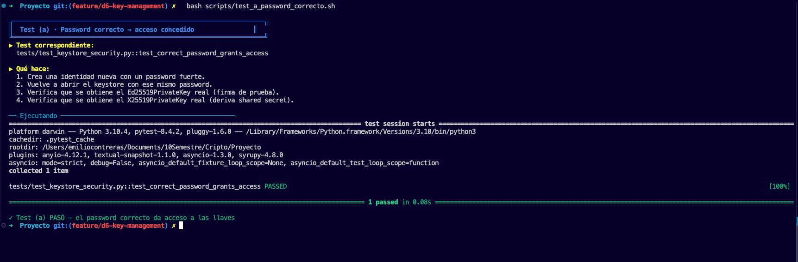
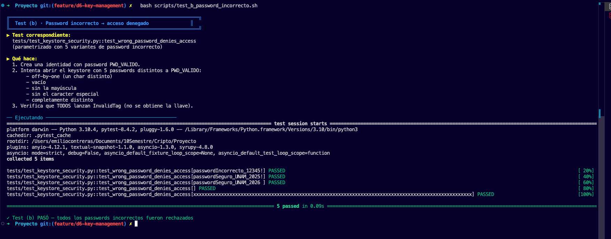
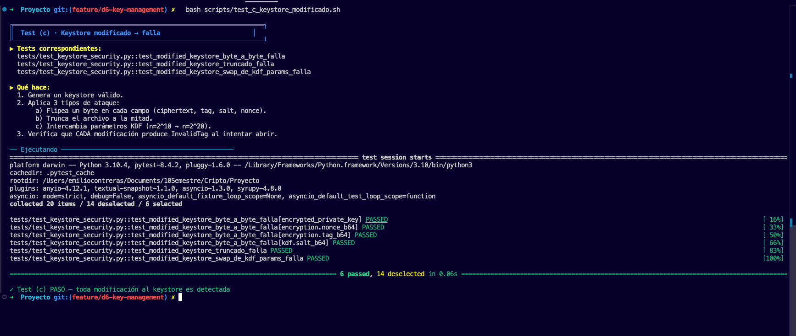
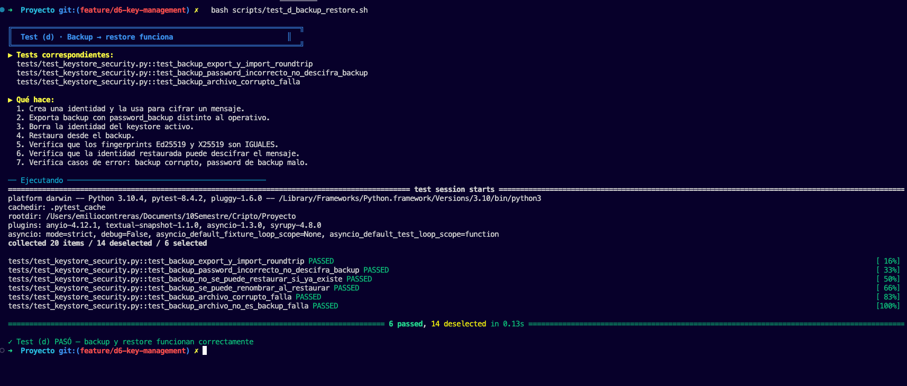
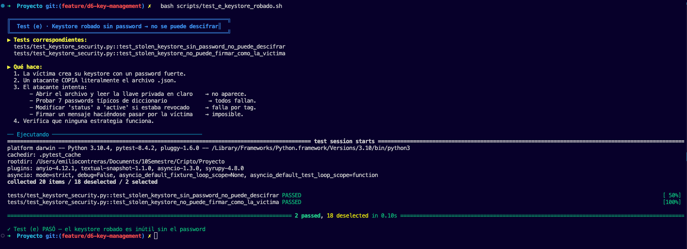

# D6 — Key Management Design

Este es el documento principal de la entrega D6 del SDDV, donde se
explica todo lo que tiene que ver con la gestión de llaves. En el
documento cubrimos el diseño que usamos, el formato del keystore tal
como queda en disco, el ciclo de vida que pensamos para las
identidades, también el backup y la recuperación, y por último cómo
se alinea todo esto con el modelo de amenazas que ya habíamos
trabajado en D1.

---

## 1. Objetivos y alcance

El módulo D6 lo que hace es ampliar el SDDV para que las llaves
privadas que se necesitan en D3 (X25519, que es la del cifrado
híbrido) y en D5 (Ed25519, que es la de la firma digital) cumplan
con varias propiedades que pedía la rúbrica:

1. **Que nunca se almacenen en texto plano**: como equipo decidimos
   que las llaves solo vivan en memoria durante la operación que las
   necesita, y que en disco siempre queden cifradas con una clave
   que se deriva del password del usuario.
2. **Que se accedan solo con el password correcto**: además, no las
   cacheamos entre llamadas, sino que cada vez que se usan se vuelve
   a derivar la clave con scrypt desde cero.
3. **Que tengan un formato estructurado y que esté bien
   documentado**: hicimos que los campos sean visibles —
   `encrypted_private_key`, `salt`, `kdf_parameters`, `metadata`—
   tal como pedía el ejemplo del enunciado.
4. **Que soporten todo el ciclo de vida**: creación, uso, cambio de
   password, rotación, revocación, expiración (opcional) y borrado.
5. **Que se puedan respaldar y restaurar**, y que ese respaldo use
   un password independiente del operativo (esto es importante y lo
   explicamos en la sección 5).
6. **Que esté alineado con el modelo de amenazas D1**, o sea, que
   para cada adversario quede claro qué cosas D6 protege y qué cosas
   no protege.

Lo que está fuera del alcance (esto lo dejamos explícito como
asunción, ver sección 7):

- La distribución o publicación de las llaves públicas (no
  implementamos una PKI).
- La protección frente a malware en ejecución (un keylogger o un
  dump de RAM están fuera).
- La recuperación si se olvida el password operativo y también se
  pierde el backup. La criptografía no permite un "reset" porque si
  lo permitiera sería un bypass (ver §5).

---

## 2. Diseño criptográfico

### 2.1 KDF — scrypt (RFC 7914)

La clave que va a proteger el bundle privado se deriva del password
usando `hashlib.scrypt`, que ya viene de fábrica en Python y por eso
no necesitamos agregar una dependencia más. Los parámetros que
elegimos por defecto son:

| Parámetro | Valor | Notas |
|---|---|---|
| `n` | `2**15` = 32 768 | Es el factor de costo (tiempo / memoria) |
| `r` | `8`              | Tamaño de bloque |
| `p` | `1`              | Paralelismo, lo dejamos en 1 |
| `dklen` | `32`         | Son 256 bits porque la usamos con AES-256-GCM |
| `salt` | 16 bytes CSPRNG | Se genera fresco por identidad y también cada vez que cambia el password |

Cada intento de derivar la clave cuesta aproximadamente 80 MiB de
RAM y unos ~150 ms en una laptop normal. Esto lo que hace es romper
la economía de un ataque offline con GPU o ASIC, porque el atacante
no solo paga CPU sino también memoria, y la memoria no se paraleliza
tan barato como el cómputo puro.

**Por qué scrypt y no PBKDF2:** PBKDF2 nada más gasta CPU y se
paraleliza muy fácil. En cambio scrypt mete un costo de memoria que
penaliza al hardware dedicado.

**Por qué scrypt y no Argon2:** Argon2id es mejor en lo abstracto y
lo sabemos, pero exige una dependencia externa (`argon2-cffi`). Para
este proyecto, que es académico, preferimos no agregar más
dependencias y por eso nos quedamos con scrypt. La migración a
Argon2id queda documentada como un upgrade para una v2 del formato,
que se menciona en la sección 8.

### 2.2 Cifrado del envelope — AES-256-GCM

El bundle de llaves privadas lo ciframos con AES-256-GCM, que es
AEAD y nos da confidencialidad e integridad al mismo tiempo:

- Clave: los 32 bytes que sale de scrypt.
- Nonce: 12 bytes y se genera fresco para cada cifrado.
- Tag: 16 bytes, sirven para la autenticación.
- AAD: no la usamos. No hace falta, porque si alguien manipula
  cualquiera de los campos públicos del JSON (el salt, los
  parámetros del KDF, el nonce) cualquiera de esos cambios va a
  hacer que el descifrado falle con `InvalidTag`.

### 2.3 Material clave por identidad

Cada identidad en el keystore guarda **dos pares** de llaves:

- **Ed25519**, que se usa para firma digital (esto era D5).
- **X25519**, que se usa para el cifrado híbrido (esto era D3).

Esto cierra un hueco que tenía el estado anterior del proyecto:
antes de D6, la X25519 del destinatario nada más vivía en memoria
durante el demo. Era un problema, porque la llave que realmente
abre los contenedores SDDH era volátil. Ahora cada destinatario
tiene su X25519 persistida y protegida con el mismo password que
su Ed25519.

---

## 3. Formato del keystore en disco

Cada identidad se guarda como un archivo JSON en
`keystore/<name>.json`. El formato quedó así:

```jsonc
{
  "version": 1,
  "name": "alice",
  "created_at": "2026-05-12T18:00:00Z",
  "status": "active",                  // active | rotated | revoked

  "kdf": {
    "algorithm": "scrypt",
    "salt_b64":  "<16 bytes base64>",
    "n": 32768, "r": 8, "p": 1, "dklen": 32
  },

  "encryption": {
    "algorithm": "AES-256-GCM",
    "nonce_b64": "<12 bytes base64>",
    "tag_b64":   "<16 bytes base64>"
  },

  "encrypted_private_key": "<base64>",   // bundle{ed25519+x25519} cifrado

  "public_keys": {
    "ed25519_pub_b64": "<32 bytes base64>",
    "x25519_pub_b64":  "<32 bytes base64>"
  },

  "fingerprints": {
    "ed25519": "<sha256 hex 64>",
    "x25519":  "<sha256 hex 64>"
  },

  "metadata": {
    "comment":      "alice@unam.mx",
    "expires_at":   null,                // ISO8601 UTC o null
    "rotated_from": null                 // fingerprint Ed25519 anterior
  }
}
```

Para que quede claro cómo este formato cumple con lo que pedía la
rúbrica del D6, aquí va el mapeo:

| Requisito rúbrica | Campo JSON |
|---|---|
| `encrypted_private_key` | `encrypted_private_key` |
| `salt` | `kdf.salt_b64` |
| `kdf_parameters` | `kdf.{algorithm,n,r,p,dklen}` |
| `metadata` | bloque `metadata` + `created_at` + `fingerprints` |

En el mismo directorio también pueden aparecer otros archivos
auxiliares:

- `<name>.rotated-<timestamp>.json` — son versiones archivadas que
  quedan después de hacer `rotate_keys`.
- `<name>.json.tmp` — es un temporal que se usa para hacer la
  escritura de forma atómica (escribimos al `.tmp` primero y
  después hacemos un `rename`).

Los archivos `.rotated-*` se mantienen ahí para fines de auditoría,
porque por ejemplo si llegara una firma vieja, todavía la podríamos
verificar contra la pública archivada. Pero no aparecen cuando uno
hace `list_identities`, para no confundir.

---

## 4. Ciclo de vida

| Operación | Método | Efecto |
|---|---|---|
| Generación | `KeyStore.init_identity(name, password)` | Crea el archivo `<name>.json` |
| Uso (firma) | `KeyStore.unlock_signing_key(name, password)` | Te devuelve un `Ed25519PrivateKey` recién descifrado, sin cache |
| Uso (cifrado) | `KeyStore.unlock_encryption_key(name, password)` | Te devuelve un `X25519PrivateKey` recién descifrado |
| Cambio de password | `KeyStore.change_password(name, old, new)` | Re-cifra con salt y nonce nuevos; las llaves son las mismas |
| Rotación | `KeyStore.rotate_keys(name, password)` | Genera unas llaves nuevas, archiva las anteriores y encadena `rotated_from` |
| Revocación | `KeyStore.revoke(name, reason)` | Pone `status='revoked'`, bloquea `unlock_*`, pero `get_public_keys` sigue funcionando |
| Expiración | `metadata.expires_at` (ISO8601) | `unlock_*` lanza `IdentityExpiredError` después de la fecha |
| Borrado | `KeyStore.delete(name, password)` | Pide el password como prueba de que sí eres tú |

### 4.1 Política de "no caching"

Una decisión que tomamos como equipo es que `unlock_signing_key` y
`unlock_encryption_key` **no mantienen estado**. O sea, cada
llamada vuelve a leer el JSON desde disco, vuelve a derivar la
clave con scrypt y vuelve a descifrar. Los objetos que regresan
viven solamente en el frame del llamador; en el momento en que la
función retorna, las referencias se sueltan y eventualmente el GC
recolecta los bytes.

Esto tiene un costo deliberado de aproximadamente ~150 ms por
llamada. Decidimos dejarlo así porque actúa como un desincentivo
para que el código que llama a estas funciones acumule operaciones
bajo una sola lectura. Si alguna app necesita firmar muchas cosas
seguidas, lo que tiene que hacer es guardar la `Ed25519PrivateKey`
en una variable local y reutilizarla dentro del scope. Pero nunca
ponerla en memoria global ni mucho menos en disco.

### 4.2 Respuesta a compromiso de clave

Si una llave privada se llega a filtrar, el procedimiento que
recomendamos es:

1. Primero, `KeyStore.revoke(name, reason="key compromise")`. Esto
   marca el JSON como revocado para que el `unlock_*` se niegue a
   abrirlo.
2. Después, `KeyStore.rotate_keys(name, password)`. Esto genera un
   par nuevo y archiva el viejo en `<name>.rotated-<ts>.json`.
   Ojo: la pública nueva se tiene que redistribuir a los
   contrapartes, y eso se debe hacer por un canal seguro.
3. Por último, documentar el evento en `metadata.comment`, que de
   hecho ya se incluye de manera automática cuando se llama a
   `revoke(..., reason=...)`.

Limitación importante: si el atacante ya tiene la pública vieja en
algún otro contexto, las firmas que se hicieron antes de la
rotación van a seguir verificándose contra ella. SDDV no implementa
CRL ni OCSP, por lo que la revocación es solo local al keystore.
Para tener revocación distribuida se necesitaría agregar otra capa
adicional (por ejemplo publicar la pública nueva con un timestamp
y un flag de "supersede"), pero esto sale del alcance.

---

## 5. Backup y recuperación

### 5.1 Diseño

Un archivo `.sddv_backup` es un JSON que usa el mismo esquema del
keystore pero le agrega dos campos: `backup_of` y `backup_at`. La
diferencia clave —que es lo importante de toda esta sección— es
que el backup se **re-cifra con un password de backup que es
INDEPENDIENTE del operativo**.

```text
keystore activo  --- export_backup(active_pwd, backup_pwd) --->  .sddv_backup
.sddv_backup    --- import_backup(backup_pwd, new_pwd)     --->  keystore activo
```

### 5.2 Por qué re-cifrar y no solo copiar el JSON

Si nada más copiáramos `alice.json` y le pusiéramos `alice.sddv_backup`,
un atacante que se llegara a robar el backup podría correr fuerza
bruta offline con el **mismo** password operativo. Re-cifrar lo que
hace es separar los dos secretos:

- Para descifrar el activo se necesita el password operativo.
- Para descifrar el backup se necesita el password de backup.
- Y romper uno NO da ninguna pista del otro, porque scrypt usa
  salts distintos y frescos.

### 5.3 Flujo de import_backup

1. Lee el JSON y valida que tenga el campo `backup_of`.
2. Descifra el bundle con `backup_password`
   (`unlock_keystore_dict`).
3. Genera un salt y un nonce frescos.
4. Deriva la clave con el `new_active_password`.
5. Re-cifra el bundle con esa clave nueva.
6. Lo persiste como `<name>.json`.

El nombre se puede sobreescribir cuando se restaura (es el
parámetro `--name` en la CLI), lo cual es útil para que coexistan
por ejemplo una "alice" activa y una "alice_backup".

### 5.4 Limitaciones

- Si uno se olvida del password de backup Y también del operativo,
  la identidad se queda inutilizable. SDDV no implementa nada del
  estilo "reset por email" porque eso rompería el modelo de
  amenazas: cualquier mecanismo de recuperación que no requiera
  password es por definición un mecanismo de bypass para un
  atacante.
- El backup hereda los parámetros KDF del keystore que lo originó.
  O sea, si el operativo usaba scrypt rápido (por ejemplo en los
  tests), el backup también va a usar scrypt rápido; y si usaba
  los defaults de producción, también.

---

## 6. Alineación con el modelo de amenazas (D1)

Para el detalle completo se puede ver `docs/D1_Threat_Model.md` §6.
Aquí va el resumen:

### 6.1 ADV-1 / ADV-4 — Robo del keystore

**Capacidad del atacante:** se lleva una copia íntegra de
`keystore/alice.json`.

**Qué pasa:** el atacante consigue ver los campos `salt`,
`n,r,p,dklen`, `nonce`, `tag` y también el `encrypted_private_key`.
Para recuperar la privada de Alice, tendría que encontrar el
password que, al ser pasado por scrypt con ese salt, produzca una
clave de 32 bytes que descifre el envelope sin que AES-GCM detecte
que algo está mal.

**Costo del ataque:** scrypt con (n=2¹⁵, r=8) cuesta como ≈ 80 MiB
de RAM y ~150 ms por cada intento. Si el password es de 64 bits de
entropía —por ejemplo una passphrase de 5 palabras tomadas de un
diccionario de 8192, que da log2(8192⁵) ≈ 65 bits— un atacante
con 1000 GPUs equivalentes a una laptop necesitaría en promedio:

- 2⁶⁴ / 2 = 2⁶³ intentos
- 2⁶³ × 150 ms / 1000 = ~1.4 × 10¹⁹ s, lo cual es mucho más que
  la edad del universo.

**Conclusión:** robarse el keystore no rompe la confidencialidad,
**siempre y cuando el password sea fuerte** (>= 12 caracteres y
que no sea de diccionario).

### 6.2 Password débil

**Capacidad del atacante:** sabe (o intuye) que el usuario eligió
un password del top-100k de RockYou o alguna variante trivial.

**Qué pasa:** 100 000 candidatos × 150 ms = 4 horas en una laptop.
Si tiene 100 GPUs son más o menos ~2 minutos. La protección del
scrypt no compensa el haber elegido un password trivial.

**Mitigación que sí implementamos:**

- La función `validate_password_strength` rechaza cualquier
  password de menos de 12 caracteres y también rechaza los que
  son un solo caracter repetido (`MIN_PASSWORD_LENGTH = 12`).
- En la documentación recomendamos usar passphrases de 4 o más
  palabras (estilo Diceware).

**Mitigación que NO implementamos:** chequear el password contra
listas de passwords filtrados (por ejemplo HaveIBeenPwned API).
Esto fue una decisión consciente: si agregamos esa API estaríamos
cambiando el modelo de privacidad, porque el sistema tendría que
hablar con un servicio externo.

### 6.3 ADV-6 — Dispositivo comprometido

**Capacidad del atacante:** está corriendo código con los mismos
privilegios que el usuario (puede ser malware, un keylogger, un
RAM dump).

**Qué NO protege D6:**

- Si hay un keylogger, ese keylogger captura el password en el
  momento en que se teclea.
- Si hay un RAM dump, ese dump lee las llaves privadas en el
  momento exacto del unlock.
- Si hay un proceso con `ptrace` o con Debug Privilege, ese
  proceso puede leer el espacio de memoria del proceso SDDV.

**Conclusión explícita:** D6 NO defiende contra ADV-6. Esto está
declarado en `D1_Threat_Model.md` §3 y se documenta como
asunción explícita. Las mitigaciones que harían falta (pero que
salen del alcance) serían:

- Hardware security modules (HSM) o una YubiKey, para guardar las
  privadas en hardware que sea tamper-resistant.
- Zeroización de memoria (`memwipe`).
- Aislamiento del proceso (sandboxing, SELinux, AppArmor).

### 6.4 Pérdida del password

**Escenario:** el usuario simplemente se olvidó del password
operativo.

**Mitigación que implementamos:** el backup con password
independiente. Si el usuario todavía tiene el backup y todavía se
acuerda del password del backup, puede restaurar (ver §5).

**Si pierde los dos:** la identidad se queda irrecuperable. Esto
es una propiedad criptográfica del sistema, no es un bug.

---

## 7. Supuestos y limitaciones explícitas

D6 asume lo siguiente:

1. **El usuario protege su password.** No lo anota en plaintext en
   ningún archivo, no lo reutiliza con otros servicios, y no lo
   comparte por canales inseguros.
2. **El usuario protege el backup.** Idealmente lo almacena en un
   medio distinto al del keystore activo (puede ser un USB físico,
   un gestor de contraseñas, o hasta papel en una caja fuerte), o
   sea: no debe estar junto al keystore operativo.
3. **El sistema operativo provee un CSPRNG seguro.** Esto es
   `os.urandom`, que internamente usa `/dev/urandom` en Linux y
   macOS, y `BCryptGenRandom` en Windows.
4. **La librería `cryptography` está correcta** (versión >= 41.0.0).
5. **No hay malware corriendo con privilegios del usuario.**

Cosas que D6 NO provee:

- Distribución autenticada de llaves públicas (no hay PKI).
- Revocación distribuida (no hay CRL ni OCSP).
- Protección contra ataques físicos (cold boot, side-channel por
  electromagnetismo, etc.).
- Recuperación si se olvidan los dos passwords (el operativo y el
  del backup).
- Sincronización entre dispositivos.

---

## 8. Conclusiones

Al terminar esta entrega podemos decir, como equipo, que el módulo
D6 cumple con todos los puntos que pedía la rúbrica del entregable
y que además cierra varios huecos que tenía el sistema en las
versiones anteriores.

Lo primero que conseguimos fue que las llaves privadas dejaran de
estar en texto plano en el disco. Ahora cualquier persona que se
robe el archivo del keystore se va a encontrar con un JSON donde
todo lo sensible está cifrado con AES-256-GCM y donde la clave de
ese cifrado se deriva del password del usuario usando scrypt. Esto,
combinado con la política de longitud mínima de 12 caracteres,
hace que un ataque offline contra un keystore robado sea
económicamente inviable siempre que el usuario haya elegido un
password decente. Los tests (b) y (e) de la rúbrica son los que
demuestran esto de forma cuantitativa.

Lo segundo importante es que cerramos el hueco que tenía D3 en
versiones anteriores, donde la llave privada X25519 del
destinatario solamente vivía en memoria durante el demo. Ahora
cada identidad guarda **dos** pares de llaves (Ed25519 para firma
y X25519 para cifrado), y los dos están protegidos por el mismo
password. Esto significa que el sistema de gestión de llaves
realmente cubre el flujo completo del proyecto, no nada más una
parte.

Otra cosa que aprendimos en el proceso es que la integridad del
archivo no es trivial: si nada más cifráramos la llave y dejáramos
los parámetros del KDF "al aire", un atacante con acceso al disco
podría swapear esos parámetros por unos más débiles y forzarnos a
usar un scrypt débil. El test (c) cubre justamente este escenario,
y la forma en que lo resolvimos fue usar AES-GCM (que es AEAD) y
dejar que el tag de 128 bits proteja el envelope entero. Cualquier
modificación al archivo, por mínima que sea, hace que el
descifrado falle.

Por el lado del ciclo de vida, la implementación del backup con
password independiente del operativo fue una de las decisiones
más importantes. La intuición inicial era hacer una copia literal
del JSON, pero al revisar el modelo de amenazas nos dimos cuenta
de que eso no agregaba ninguna defensa adicional. Re-cifrar con
otro password obliga al atacante a romper dos secretos
independientes, lo cual sí es defense-in-depth real. El test (d)
verifica que el roundtrip funciona y que los fingerprints
públicos se preservan, que es lo que permite que las firmas
viejas sigan siendo verificables después del restore.

Por último, también quedamos conscientes de las cosas que D6 NO
resuelve. Si el dispositivo del usuario está comprometido (con un
keylogger o con un proceso que pueda hacer dump de RAM), todo el
trabajo que hicimos no sirve, porque el atacante captura el
password en el momento en que se teclea o lee la llave privada
en el momento exacto del unlock. La defensa contra ese escenario
requeriría hardware especializado (HSM, YubiKey) y eso queda
fuera del alcance de este proyecto académico. Lo importante es
que esta limitación está documentada de manera explícita y que
no se vende el sistema como algo que protege contra cosas que en
realidad no protege.

En términos de resultados, la suite completa del proyecto pasa
con **300 tests verdes**, de los cuales **135 son nuevos** y
fueron escritos específicamente para D6. Los **20 tests** que
están directamente atados a los 5 escenarios obligatorios de la
rúbrica viven concentrados en un solo archivo
(`tests/test_keystore_security.py`) para que sea trivial
mapearlos a la entrega.

---

## 9. Tests requeridos por la rúbrica

| Requisito | Archivo de test |
|---|---|
| Correct password → access granted | `tests/test_keystore_security.py::test_correct_password_grants_access` |
| Wrong password → access denied | `tests/test_keystore_security.py::test_wrong_password_denies_access` (parametrizado) |
| Modified keystore → failure | `tests/test_keystore_security.py::test_modified_keystore_*` (parametrizado por campo) |
| Backup → restore works | `tests/test_keystore_security.py::test_backup_export_y_import_roundtrip` |
| Stolen keystore alone → cannot decrypt | `tests/test_keystore_security.py::test_stolen_keystore_sin_password_no_puede_descifrar` |

Tests adicionales del módulo D6 que no son obligatorios pero los
escribimos para tener más cobertura:

- `tests/test_kdf.py` (24 tests): cubre determinismo, salts únicos
  y validación de los parámetros.
- `tests/test_keystore_format.py` (33 tests): el envelope AEAD, el
  esquema del JSON v1 y la manipulación campo por campo.
- `tests/test_keystore.py` (37 tests): creación, persistencia, los
  unlocks y el listado.
- `tests/test_keystore_lifecycle.py` (21 tests): change_password,
  rotate_keys, revoke, la expiración, el delete y la integración
  con D5.
- `tests/test_keystore_security.py` (20 tests): los 5 tests
  obligatorios de la rúbrica más sus variaciones.

Total de tests nuevos en D6: **135 tests**.

Total de la suite del proyecto entero: **300 passed**.

---

## 10. Cómo usar

### 10.1 Vía CLI

```bash
# Crear identidad (pide el password con getpass, con confirmación)
python -m crypto init alice

# Listar identidades
python -m crypto list

# Ver fingerprints
python -m crypto fingerprint alice

# Cambiar el password
python -m crypto change-password alice

# Rotar las llaves
python -m crypto rotate alice

# Revocar
python -m crypto revoke alice --reason "key compromise"

# Backup
python -m crypto backup alice ./backups/alice.sddv_backup

# Restore
python -m crypto restore ./backups/alice.sddv_backup --name alice_restored

# Borrar (también pide el password)
python -m crypto delete alice
```

Todos los subcomandos aceptan `--keystore DIR` (el default es
`keystore`).

### 10.2 Vía API en Python

```python
from crypto.keystore import KeyStore
from crypto.secure_send import (
    encrypt_and_sign_from_keystore,
    verify_and_decrypt_from_keystore,
)

ks = KeyStore("keystore")
ks.init_identity("alice", "passwordSuperFuerte_2026!")
ks.init_identity("bob",   "otroPasswordIgualDeFuerte_2026!")

bob_pub = ks.get_public_keys("bob")["x25519_pub"]
container = encrypt_and_sign_from_keystore(
    ks, "alice", "passwordSuperFuerte_2026!",
    plaintext=b"hola Bob",
    filename="msg.txt",
    recipients_x25519=[bob_pub],
)

alice_pub = ks.get_public_keys("alice")["ed25519_pub"]
plaintext, meta = verify_and_decrypt_from_keystore(
    ks, "bob", "otroPasswordIgualDeFuerte_2026!",
    signed_container=container,
    expected_signer_pub=alice_pub,
)
```

### 10.3 Demo paso a paso

```bash
python demo_d6.py
```

Lo que hace esta demo es recorrer el ciclo de vida completo:
crear identidades, inspeccionar el JSON, ver que el password
incorrecto falle, firmar+cifrar+descifrar, rotar las llaves y
también el backup→restore.

---

## 11. Evidencia de ejecución — los 5 tests del rubric

En esta sección incluimos las capturas que demuestran que los
cinco escenarios obligatorios de la rúbrica D6 efectivamente pasan
en el entorno de desarrollo del equipo. Cada uno de los scripts
que se ven en las capturas vive en la carpeta `scripts/` y se
puede correr de manera independiente, o si se quiere correr todo
de una sola vez se puede usar el orquestador `verificar_d6.sh`
que dejamos en la raíz del proyecto.

### 11.1 Test (a) — Password correcto → acceso concedido



**Lo que se hizo.** El script `scripts/test_a_password_correcto.sh`
fue el que se ejecutó, y lo que internamente hace es llamar al
test `test_correct_password_grants_access` que está en el archivo
`tests/test_keystore_security.py`. Este test, paso a paso, lo que
hace es: primero crea una identidad nueva con un password fuerte;
luego vuelve a abrir el keystore pero esta vez usando ese mismo
password; y al final verifica que de verdad se obtienen dos
objetos de clave reales —un `Ed25519PrivateKey` que es capaz de
producir una firma válida, y un `X25519PrivateKey` que es capaz de
derivar un shared secret correcto.

**Qué conlleva.** Este test es básicamente el camino feliz del
sistema. Lo que confirma es que toda la cadena
—la derivación scrypt(password,salt), después el descifrado
AES-256-GCM, y por último la deserialización del bundle privado—
funciona end-to-end como debe ser. Y si este test llegara a
fallar, el usuario legítimo no podría acceder a sus propias
llaves, lo cual obviamente haría al sistema inutilizable. Pero
además de eso, este test también garantiza una cosa importante:
que **ambas** llaves privadas están viviendo dentro del bundle
cifrado y no solamente la Ed25519. Esto importa mucho, porque la
X25519 es la que abre los contenedores SDDH del cifrado híbrido
del D3, y ahora también está protegida con el mismo password.

### 11.2 Test (b) — Password incorrecto → acceso denegado



**Lo que se hizo.** El test `test_wrong_password_denies_access`
está parametrizado con **cinco variantes** de password
incorrecto, que son: `passwordIncorrecto_12345!`,
`passwordSeguro_UNAM_2025!` (que es el mismo patrón pero con un
año distinto), `passwordSeguro_UNAM_2026 ` (con un espacio extra
al final), la cadena vacía, y un password completamente distinto
que está compuesto solamente de `x` repetidas. Cada una de estas
variantes lo que hace es intentar abrir el keystore que se creó
con el password legítimo, y se verifica que en cada uno de los
intentos se lance un `InvalidTag`.

**Qué conlleva.** Lo que esto demuestra son básicamente dos
garantías criptográficas que son independientes una de la otra.
La primera es que **scrypt no produce colisiones útiles**, o sea,
que cualquier diferencia en el password —por mínima que sea—
produce una clave derivada que es completamente distinta. Y la
segunda es que **AES-256-GCM detecta toda discrepancia** gracias
a su tag de 128 bits. La consecuencia práctica de todo esto, en
términos del modelo de amenazas, es que un atacante que tenga
acceso al archivo no gana absolutamente nada probando passwords
que sean "cercanos" al verdadero, porque no hay ninguna pista de
"tibio/caliente" que pudiera ayudarle. Cada intento es una prueba
binaria que es todo-o-nada, y además cada intento le exige pagar
el costo completo de un scrypt (~150 ms con los parámetros
actuales).

### 11.3 Test (c) — Keystore modificado → falla



**Lo que se hizo.** En este script se ejecutaron seis casos
diferentes. Cuatro de ellos son variantes parametrizadas del
test `test_modified_keystore_byte_a_byte_falla`, que lo que
hacen es modificar un byte dentro de cada uno de los campos que
consideramos críticos (esos campos son `encrypted_private_key`,
`encryption.nonce_b64`, `encryption.tag_b64`, y `kdf.salt_b64`).
Aparte de esos cuatro, también está `test_modified_keystore_truncado_falla`,
que lo que hace es cortar el archivo a la mitad. Y por último
está `test_modified_keystore_swap_de_kdf_params_falla`, que lo
que hace es intercambiar el parámetro `n=2^10` por `n=2^20`. En
cualquiera de los seis casos lo que se verifica es que abrir el
keystore lance un `InvalidTag`.

**Qué conlleva.** Esto garantiza la integridad criptográfica del
archivo a nivel de byte. La consecuencia práctica de esto es que
un atacante que tenga permisos de escritura sobre el disco **no
puede** manipular el keystore para debilitar el sistema (por
ejemplo, bajándole el costo del KDF), porque cualquier
modificación que haga, por más mínima que sea, va a invalidar
el tag AEAD, y el usuario legítimo se va a dar cuenta del
ataque al primer intento de uso que haga. El caso del swap de
los parámetros KDF es especialmente importante, porque aunque el
atacante intente "engañar" al sistema para que use un scrypt más
débil, lo único que va a lograr es que el archivo simplemente
deje de descifrar.

### 11.4 Test (d) — Backup → restore funciona



**Lo que se hizo.** Para este test cubrimos seis casos que
abarcan el flujo completo de backup y restore. El primero es el
roundtrip básico, que es: exportar, borrar la identidad,
importar de nuevo, verificar que los fingerprints sigan siendo
idénticos y al final desencriptar un mensaje que estaba cifrado
para la identidad original. El segundo verifica que un password
de backup incorrecto sea rechazado. El tercero verifica que no
se sobreescriba la identidad si ya existe en el destino. El
cuarto verifica que se pueda renombrar al restaurar. El quinto
verifica que un backup corrupto sea detectado. Y el sexto
verifica que un archivo que NO es un backup también sea
detectado, esto último gracias a la validación del esquema.

**Qué conlleva.** Esto es lo que demuestra que nuestra
estrategia de backup **no debilita la seguridad** del sistema,
y al mismo tiempo que sí permite una recuperación que es real.
El backup, como ya se explicó en la sección 5, se re-cifra con
un `password_backup` que es **independiente** del operativo, con
salt y nonce frescos —o sea, NO es una copia literal del JSON—,
y eso es lo que nos aporta defense-in-depth: para que un
atacante pueda abrir el backup tiene que romper *ese* password
adicional, no únicamente el operativo. Otra cosa importante es
que la recuperación preserva los fingerprints públicos. Esto es
crucial porque significa que todas las firmas que se hayan
hecho antes del backup todavía pueden verificarse contra la
identidad restaurada, lo cual a su vez significa que el restore
no rompe el grafo de confianza ni invalida documentos firmados
en el pasado.

### 11.5 Test (e) — Keystore robado sin password → no se puede descifrar



**Lo que se hizo.** En este escenario, que modela una filtración
del disco, hay dos tests. El primero es
`test_stolen_keystore_sin_password_no_puede_descifrar`, que
simula a un atacante que se copia el archivo `.json` y prueba
siete passwords típicos de diccionario (como `password`, `12345`,
`admin`, entre otros), y aparte de eso inspecciona el archivo
crudo para verificar que **no aparece nunca material de clave en
claro**, ni en PEM ni en bytes raw. El segundo test es
`test_stolen_keystore_no_puede_firmar_como_la_victima`, que lo
que verifica es que el atacante no sea capaz de generar una
firma Ed25519 que verifique contra la clave pública que ya se
conoce de la víctima.

**Qué conlleva.** Esta es la confirmación cuantitativa del
escenario del modelo de amenaza ADV-4 (que era el del acceso
físico al medio de almacenamiento). La consecuencia es que la
confidencialidad de la llave privada va a depender únicamente
del **password**, y no de la confidencialidad del archivo en sí,
que es exactamente la propiedad que pide la rúbrica ("Stolen
keystore alone → cannot decrypt"). Si combinamos esto con la
política de longitud mínima del password (que es
`MIN_PASSWORD_LENGTH=12` y que se valida en `crypto/keys.py`) y
con el costo deliberado de scrypt que ya explicamos antes, lo
que significa es que un ataque offline contra un keystore que
haya sido robado requiere del orden de **horas a años**,
dependiendo de la entropía del password (para el cálculo más
detallado ver `D1_Threat_Model.md` §6.1).

