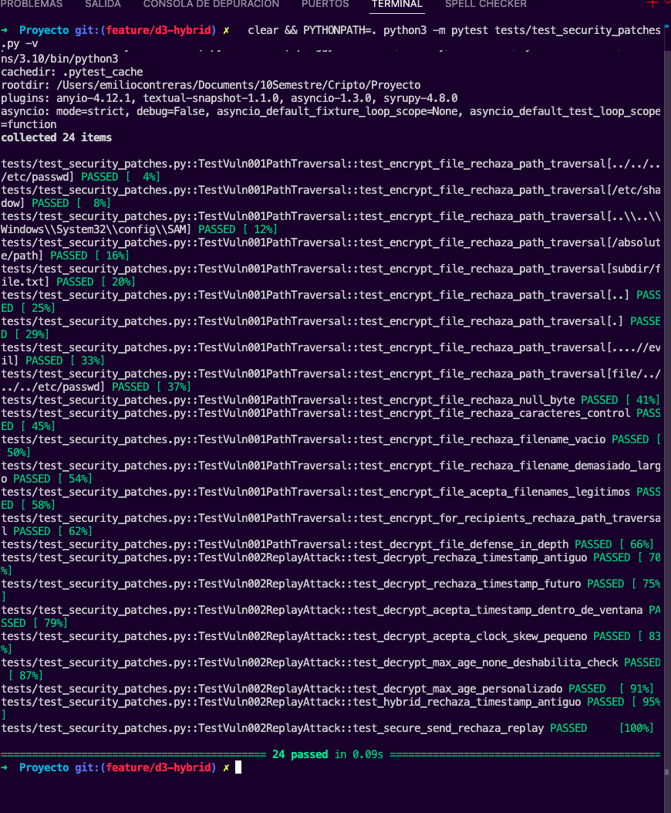
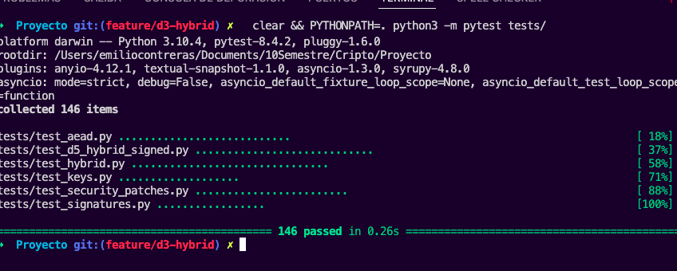

# Resumen

En el reporte anterior probamos los cinco vectores que pedía la actividad (metadata, lista de destinatarios, nonce, firma y key identifier) y vimos que el sistema los detectaba todos. Pero como nos pidieron ahora reescribir el reporte buscando vulnerabilidades reales con su parche y todo, nos pusimos a revisar el código más a fondo y encontramos dos cosas que sí son problemas de seguridad de verdad. En este reporte explicamos cada una con la estructura que pidió la profe, mostramos cómo se reproducen y los parches que ya subimos al repo.

**Las dos vulnerabilidades que encontramos:**

\begin{center}
\begin{tabular}{lllll}
\toprule
\textbf{ID} & \textbf{Título} & \textbf{CWE} & \textbf{Severidad} & \textbf{Commit del parche} \\
\midrule
VULN-001 & Path Traversal en el filename     & CWE-22  & ALTA   & \texttt{b40d0c0} \\
VULN-002 & Replay Attack (sin freshness)     & CWE-294 & MEDIA  & \texttt{6a98cd1} \\
\bottomrule
\end{tabular}
\end{center}

\newpage

# VULN-001 — Path Traversal en el filename

## Título

**Path Traversal en el campo `filename` de los contenedores SDDV/SDDH (CWE-22)**

## Descripción

Lo que pasa con esta vulnerabilidad es que cuando el sistema cifra un archivo, el nombre que le pongas se guarda dentro del contenedor sin que nadie revise si es un nombre seguro o no. Y al momento de descifrar, el nombre se devuelve tal cual, sin sanitizar. Es decir, si el atacante mete cosas raras en el nombre, esas cosas raras llegan intactas hasta la aplicación que recibe el archivo.

El problema es que muchas aplicaciones, después de descifrar, hacen algo así para guardar el archivo en disco:

```python
plaintext, meta = decrypt_file(container, key)
with open(os.path.join(out_dir, meta['filename']), 'wb') as f:
    f.write(plaintext)
```

Y si el atacante puso como filename algo como `../../../etc/passwd`, pues ese `os.path.join` no va a guardar en `out_dir` sino que va a salir del directorio destino y va a sobrescribir un archivo del sistema. Y la librería ni se entera, no avisa, no rechaza nada.

Esto afecta tanto al cifrado simétrico (`crypto/aead.py`) como al cifrado híbrido (`crypto/hybrid.py`), porque los dos comparten la misma forma de armar y leer el header del contenedor.

## Impacto

\begin{tcolorbox}[colback=red!5!white,colframe=red!75!black,title=Severidad: ALTA (CWE-22)]
\textbf{Qué propiedad de seguridad afecta:} principalmente Integridad (porque permite sobrescribir archivos sin que el sistema lo detecte). Indirectamente también puede afectar Confidencialidad y Disponibilidad, dependiendo de qué archivos sobrescriba el atacante.

\textbf{Quién puede explotar esto:} cualquiera que pueda cifrar un contenedor que el sistema vaya a procesar. Esto incluye a usuarios legítimos del sistema con malas intenciones.

\textbf{Qué puede pasar en la práctica:}
\begin{itemize}
    \item Sobrescribir archivos de configuración del sistema, como \texttt{/etc/cron.d/}, \texttt{.bashrc} o \texttt{.ssh/authorized\_keys}
    \item Si el sistema corre con privilegios, podría llevar a ejecución remota de código (RCE)
    \item Sobrescribir archivos del usuario sin que se entere
    \item Engañar al sistema para escribir en cualquier ruta arbitraria del filesystem
\end{itemize}
\end{tcolorbox}

## Pasos de reproducción

**Lo que necesitas para reproducir esto:**

- Tener instalado el paquete `cryptography` (`pip install cryptography`)
- Estar en la raíz del repositorio del proyecto
- (Opcional) Hacer checkout al commit anterior al fix para ver la vulnerabilidad sin parchar

**Paso 1.** Si quieres ver la vulnerabilidad en su versión sin parchar, regresa al commit anterior:

```
git checkout 867516c
```

**Paso 2.** Corre el script de reproducción que dejamos en `audit/`:

```
PYTHONPATH=. python3 audit/vuln1_path_traversal.py
```

**Paso 3.** Vas a ver que el sistema acepta sin protestar todos estos filenames maliciosos:

```
[ACEPTADO] filename = '../../../etc/passwd'
           metadata['filename'] retornado = '../../../etc/passwd'
[ACEPTADO] filename = '/etc/shadow'
           metadata['filename'] retornado = '/etc/shadow'
[ACEPTADO] filename = 'valid.txt\x00../../../tmp/pwned'
           metadata['filename'] retornado = 'valid.txt\x00../../../tmp/pwned'
[ACEPTADO] filename = '....//....//etc/secret'
           metadata['filename'] retornado = '....//....//etc/secret'
```

**Paso 4.** En el script también dejamos un caso donde se demuestra la explotación de verdad. Lo que hace el script es:

1. Crea un directorio destino legítimo en `/tmp/sddv_audit_XXX/`
2. Crea un "archivo crítico" en otro directorio (`/tmp/critical_YYY/config.cfg`) con contenido `contenido_legitimo=true`
3. El atacante cifra un payload con contenido `contenido_malicioso=true` y le pone como filename una ruta relativa que apunta a ese archivo crítico desde el directorio destino: `../critical_YYY/config.cfg`
4. La aplicación vulnerable recibe el contenedor, lo descifra, y hace `open(os.path.join(out_dir, meta['filename']), 'wb').write(plaintext)`
5. **Resultado:** el archivo crítico fue sobrescrito por el contenido del atacante. El sistema no se enteró, todo se hizo pasar por una operación normal.

**Paso 5.** Si quieres reproducirlo manualmente con menos código:

```python
from crypto.aead import encrypt_file, decrypt_file
container, key = encrypt_file(b"payload", "../../../etc/passwd")
plaintext, meta = decrypt_file(container, key)
print(meta['filename'])   # imprime '../../../etc/passwd' sin protestar
```

## Solución propuesta

**Por qué decidimos arreglarlo así:**

Lo primero que pensamos fue: "esto es responsabilidad de la aplicación que usa la librería, no de la librería en sí". Pero después leímos sobre el principio de defense-in-depth y nos dimos cuenta de que una librería de criptografía no debería confiar en que la app que la usa va a sanitizar bien los datos. Si la librería va a aceptar y devolver un filename, lo más responsable es que ella misma valide que sea seguro.

Decidimos validar el filename en dos lugares:

- **Al cifrar:** para que el sistema nunca produzca contenedores con filenames raros
- **Al descifrar:** para proteger casos donde alguien recibe un contenedor que fue cifrado con una versión vieja de la librería que no validaba (defense-in-depth)

Lo que rechazamos:

- Separadores de path: `/` y `\`
- Componentes de directorio padre como `..`
- Rutas absolutas (Unix tipo `/etc/...` o Windows tipo `C:`)
- Bytes nulos `\x00` (que se usan para hacer null byte injection)
- Caracteres de control (los que tienen código menor a `0x20`)
- Filenames vacíos
- Filenames más largos que 255 bytes (que es el límite estándar de la mayoría de filesystems)

**El código del parche (extracto de `crypto/aead.py`):**

```python
def _validate_filename(filename: str) -> None:
    """Valida que el filename sea seguro para uso en filesystem (CWE-22)."""
    if not isinstance(filename, str):
        raise ValueError("filename debe ser str")
    if not filename:
        raise ValueError("filename no puede estar vacio")
    if len(filename.encode("utf-8")) > MAX_FILENAME_LEN:
        raise ValueError(f"filename excede {MAX_FILENAME_LEN} bytes")
    if "\x00" in filename:
        raise ValueError("filename contiene byte nulo (null byte injection)")
    if any(ord(c) < 0x20 for c in filename):
        raise ValueError("filename contiene caracteres de control")
    if "/" in filename or "\\" in filename:
        raise ValueError("filename contiene separadores de path")
    if filename in (".", ".."):
        raise ValueError("filename no puede ser '.' o '..'")
    if len(filename) >= 2 and filename[1] == ":":
        raise ValueError("filename parece ruta absoluta de Windows")
    if posixpath.normpath(filename) != filename:
        raise ValueError("filename contiene componentes de path no canonicos")
```

**Commit del parche:** `b40d0c0` ([feature/d3-hybrid en GitHub](https://github.com/milliyx/Cryptography/commit/b40d0c0))

**Lo que cambia el parche:**

- `crypto/aead.py`: agregamos la función `_validate_filename` y la invocamos al cifrar y al descifrar
- `crypto/hybrid.py`: importamos la función y la invocamos también en el cifrado híbrido
- `tests/test_security_patches.py`: agregamos 16 tests de regresión que verifican que todos los filenames maliciosos sean rechazados y que los nombres normales sigan funcionando

**Cómo verificar que el parche funciona:** después de aplicar el fix, si corres el script `audit/vuln1_path_traversal.py` ya no vas a ver `[ACEPTADO]` en los nombres maliciosos sino `[RECHAZADO] ValueError: filename contiene separadores de path`. Y los 16 tests de regresión pasan: `pytest tests/test_security_patches.py::TestVuln001PathTraversal -v`.

\newpage

## Evidencia de la ejecución (VULN-001)

A continuación incluimos las salidas completas del script de reproducción `audit/vuln1_path_traversal.py` antes y después del parche, capturadas directamente de la terminal.

### Antes del parche (vulnerabilidad activa)

Esto es lo que sale cuando se corre el script en el commit `867516c` (antes de aplicar el fix). Los `[VULNERABLE - ACEPTADO]` indican que el sistema acepta sin protestar todos los nombres maliciosos:

```
########################################################################
#           REPRODUCCION VULN-001: Path Traversal via filename         #
#                        CWE-22 — Severidad HIGH                       #
########################################################################

========================================================================
  CASO 1 — Path traversal en SDDV (crypto/aead.py)
========================================================================

  El atacante intenta cifrar 34 bytes con cada uno de
  estos filenames maliciosos:

  [VULNERABLE - ACEPTADO] filename = '../../../etc/passwd'
             metadata['filename'] retornado = '../../../etc/passwd'

  [VULNERABLE - ACEPTADO] filename = '/etc/shadow'
             metadata['filename'] retornado = '/etc/shadow'

  [VULNERABLE - ACEPTADO] filename = '..\\..\\Windows\\System32\\config\\SAM'
             metadata['filename'] retornado = '..\\..\\Windows\\System32\\config\\SAM'

  [VULNERABLE - ACEPTADO] filename = 'valid.txt\x00../../../tmp/pwned'
             metadata['filename'] retornado = 'valid.txt\x00../../../tmp/pwned'

  [VULNERABLE - ACEPTADO] filename = '/absolute/path/to/critical.conf'
             metadata['filename'] retornado = '/absolute/path/to/critical.conf'

  [VULNERABLE - ACEPTADO] filename = '....//....//etc/secret'
             metadata['filename'] retornado = '....//....//etc/secret'


========================================================================
  CASO 2 — Path traversal en SDDH (crypto/hybrid.py)
========================================================================

  El atacante intenta cifrar para Bob con filenames maliciosos:

  [VULNERABLE - ACEPTADO] filename = '../../../tmp/pwned.txt'
             metadata['filename'] retornado = '../../../tmp/pwned.txt'

  [VULNERABLE - ACEPTADO] filename = '/etc/cron.d/backdoor'
             metadata['filename'] retornado = '/etc/cron.d/backdoor'


========================================================================
  CASO 3 — Explotacion concreta: escritura fuera del directorio
========================================================================

  Simulamos una aplicacion vulnerable que descifra un contenedor y guarda
  el plaintext con el filename del metadata. Esto es un patron tipico:

      plaintext, meta = decrypt_file(container, key)
      with open(os.path.join(out_dir, meta['filename']), 'wb') as f:
          f.write(plaintext)

  Directorio destino legitimo: /tmp/sddv_audit_s5tfsw2a
  Archivo critico (existe ANTES del ataque): /tmp/critical_93wzg7ul/config.cfg
  Contenido original: contenido_legitimo=true

  El atacante construye filename relativo: '../critical_93wzg7ul/config.cfg'
  Aplicacion recibe metadata['filename'] = '../critical_93wzg7ul/config.cfg'
  Aplicacion escribe en: os.path.join('/tmp/sddv_audit_s5tfsw2a', '../critical_93wzg7ul/config.cfg')

  Contenido despues del ataque: contenido_malicioso=true

  [!!! VULNERABILIDAD CONFIRMADA !!!]
  El archivo /tmp/critical_93wzg7ul/config.cfg fue sobrescrito por
  el contenido controlado por el atacante. La libreria cripto no
  detuvo este ataque.

========================================================================
  CONCLUSION:
  El sistema acepta cualquier filename arbitrario sin validar y lo
  retorna intacto al descifrar. Cualquier aplicacion que use
  metadata['filename'] como path es vulnerable a path traversal.
========================================================================
```

### Después del parche (vulnerabilidad cerrada)

La siguiente captura muestra la ejecución del script ya con el parche aplicado. Cada filename malicioso es rechazado con `ValueError: filename contiene separadores de path` en la fase de cifrado, antes de poder construir el contenedor.

{width=95%}

\newpage

Y este es el output completo con el parche `b40d0c0` ya aplicado (commit actual). Los `[PARCHE - RECHAZADO]` muestran que ahora cada filename malicioso se rechaza con `ValueError`:

```

########################################################################
#           REPRODUCCION VULN-001: Path Traversal via filename         #
#                        CWE-22 — Severidad HIGH                       #
########################################################################

========================================================================
  CASO 1 — Path traversal en SDDV (crypto/aead.py)
========================================================================

  El atacante intenta cifrar 34 bytes con cada uno
  de estos filenames maliciosos:

  [PARCHE - CIFRADO RECHAZADO] '../../../etc/passwd'
             ValueError: filename contiene separadores de path

  [PARCHE - CIFRADO RECHAZADO] '/etc/shadow'
             ValueError: filename contiene separadores de path

  [PARCHE - CIFRADO RECHAZADO] '..\\..\\Windows\\System32\\config\\SAM'
             ValueError: filename contiene separadores de path

  [PARCHE - CIFRADO RECHAZADO] 'valid.txt\x00../../../tmp/pwned'
             ValueError: filename contiene byte nulo (null byte injection)

  [PARCHE - CIFRADO RECHAZADO] '/absolute/path/to/critical.conf'
             ValueError: filename contiene separadores de path

  [PARCHE - CIFRADO RECHAZADO] '....//....//etc/secret'
             ValueError: filename contiene separadores de path


========================================================================
  CASO 2 — Path traversal en SDDH (crypto/hybrid.py)
========================================================================

  El atacante intenta cifrar para Bob con filenames maliciosos:

  [PARCHE - RECHAZADO] '../../../tmp/pwned.txt'
             ValueError: filename contiene separadores de path

  [PARCHE - RECHAZADO] '/etc/cron.d/backdoor'
             ValueError: filename contiene separadores de path


========================================================================
  CASO 3 — Explotacion concreta: escritura fuera del directorio
========================================================================

  Simulamos una aplicacion vulnerable que descifra un contenedor y guarda
  el plaintext con el filename del metadata. Esto es un patron tipico:

      plaintext, meta = decrypt_file(container, key)
      with open(os.path.join(out_dir, meta['filename']), 'wb') as f:
          f.write(plaintext)

  Directorio destino legitimo: /var/folders/gm/f7rjxwjs2tg729bjy8j_hhym0000gn/T/sddv_audit_hdwe3uv7
  Archivo critico (existe ANTES del ataque): /var/folders/gm/f7rjxwjs2tg729bjy8j_hhym0000gn/T/critical__cq6ff3c/config.cfg
  Contenido original: contenido_legitimo=true

  El atacante construye filename relativo: '../critical__cq6ff3c/config.cfg'

  [PARCHE BLOQUEA EL ATAQUE EN LA FASE DE CIFRADO]
  encrypt_file rechazo el filename malicioso:
  ValueError: filename contiene separadores de path

========================================================================
  CONCLUSION:
  El sistema acepta cualquier filename arbitrario sin validar y lo
  retorna intacto al descifrar. Cualquier aplicacion que use
  metadata['filename'] como path es vulnerable a path traversal.
========================================================================
```

\newpage

# VULN-002 — Replay Attack (sin freshness)

## Título

**Falta de validación de freshness en el `timestamp` permite replay attacks (CWE-294)**

## Descripción

Esta vulnerabilidad es más sutil que la anterior. El sistema guarda un campo `timestamp` (la hora Unix de cuando se cifró) dentro del AAD del contenedor. Como está en el AAD, el timestamp queda autenticado: si alguien intenta modificarlo, se invalida el TAG y el sistema lo detecta. **Hasta ahí, todo bien.**

El problema es que el sistema **nunca compara ese timestamp contra la hora actual**. Solo lo guarda y lo devuelve, pero no le pregunta "¿este mensaje es de hace cuánto?". Lo que significa que un contenedor firmado en 2020 sigue siendo aceptado como válido en 2026, en 2030, en 2099. Para siempre.

¿Por qué es un problema? Porque un atacante que pueda capturar un contenedor legítimo (digamos, sniffeando el canal donde se transmite, o copiándolo del storage) puede después reentregarlo tiempo después y hacerlo pasar como si fuera nuevo. La firma sigue siendo válida porque Ed25519 es determinista (los mismos bytes producen la misma firma siempre), y como el contenido no cambió, todo se ve perfecto desde el lado del sistema.

Un detalle importante: el atacante **no puede modificar el timestamp** para hacer parecer que el mensaje es nuevo. Si lo intenta, el TAG falla y se detecta. Pero **tampoco lo necesita**: con que el sistema no valide la edad del mensaje, ya con eso le basta para reproducir el ataque.

## Impacto

\begin{tcolorbox}[colback=orange!5!white,colframe=orange!75!black,title=Severidad: MEDIA (CWE-294)]
\textbf{Qué propiedad de seguridad afecta:} Autenticidad y frescura. El sistema garantiza que el mensaje fue dicho por quien dice haberlo dicho, pero no garantiza que sea un mensaje reciente. La confidencialidad y la integridad del mensaje siguen intactas.

\textbf{Quién puede explotar esto:} cualquiera con acceso pasivo al canal donde se transmiten los contenedores, o con acceso al storage donde se guardan. No necesita romper criptografía ni tener llaves privadas.

\textbf{Qué puede pasar en la práctica:}
\begin{itemize}
    \item Re-ejecutar comandos firmados antiguos (transferencias bancarias, autorizaciones, votos electrónicos)
    \item Saltarse revocaciones: si Alice quitó la autorización, los mensajes anteriores siguen siendo válidos
    \item Reenviar credenciales o tokens si se transmiten en este formato
    \item El sistema acepta también timestamps imposibles, como del año 2099, sin protestar
\end{itemize}

\textbf{Por qué la severidad no es alta:} para que el ataque funcione, el atacante necesita primero capturar un mensaje legítimo (no es un ataque que se pueda hacer ``de cero''). Además, el contenido del mensaje no se le revela al atacante (la confidencialidad sigue intacta).
\end{tcolorbox}

## Pasos de reproducción

**Lo que necesitas:** lo mismo que para VULN-001.

**Paso 1.** Para ver la vulnerabilidad sin parchar, regresa al commit anterior al fix de VULN-002:

```
git checkout b40d0c0   # VULN-001 ya parchada, pero VULN-002 todavia presente
```

**Paso 2.** Corre el script de reproducción:

```
PYTHONPATH=. python3 audit/vuln2_replay.py
```

**Paso 3.** El script muestra tres casos distintos. Te explicamos cada uno:

**Caso A — Replay simple sobre cifrado simétrico:**

Alice cifra un mensaje con timestamp del 1 de enero de 2020. El atacante captura el contenedor. Tiempo después, en 2026, el atacante reentrega el mismo contenedor a Bob. Bob lo descifra:

```
contenido recuperado: b'Transferir $1000 de Alice a Bob'
edad del mensaje: 2317 dias
```

El sistema acepta sin protestar un mensaje que tiene más de seis años. Si esto fuera una orden de transferencia bancaria, ya estaríamos en problemas.

**Caso B — Replay sobre contenedor firmado completo (D5):**

Este es el caso más realista. Alice firma una autorización con su llave Ed25519 en junio de 2024. El atacante captura el contenedor pasando por la red. En 2026 lo reentrega a Bob, quien usa `secure_verify_and_decrypt` para verificar. La firma pasa, el descifrado funciona, Bob recibe `b'Autorizo la transferencia de fondos. - Alice'` como si fuera reciente. **689 días de antigüedad, ignorados completamente.**

**Caso C — Aceptación de timestamps imposibles:**

Un cliente con el reloj mal configurado (o un atacante a propósito) puede generar contenedores con timestamp del año 2099. El sistema los acepta sin distinguir entre tiempos posibles e imposibles.

**Paso 4.** Para reproducir la idea principal manualmente:

```python
import time
from crypto.aead import encrypt_file, decrypt_file

# Atacante captura contenedor antiguo (timestamp del 2020)
container, key = encrypt_file(b"comando antiguo", "cmd.txt", timestamp=1577836800)

# Sistema lo acepta hoy sin protestar
plaintext, meta = decrypt_file(container, key)
print(plaintext, "edad:", (time.time() - meta['timestamp']) / 86400, "dias")
```

## Solución propuesta

**Cómo decidimos arreglarlo:**

Lo estándar para protegerse contra replay attacks es validar que el timestamp del mensaje esté dentro de una **ventana de tiempo aceptable**. Por ejemplo: rechazar mensajes más viejos que 7 días. Las decisiones que tomamos:

1. **Default seguro:** la validación está activa por defecto con una ventana de 7 días. Eso significa que el comportamiento por default ya es seguro contra replay sin que la app que usa la librería tenga que hacer nada extra.

2. **Tolerancia a desfases de reloj:** los relojes de las computadoras a veces están un poco mal sincronizados. Permitimos hasta 5 minutos de timestamp en el futuro, porque más allá de eso ya es sospechoso. Esto se llama "clock skew tolerance".

3. **Sin necesidad de mantener estado:** la validación es solo función del timestamp del contenedor y la hora actual. No necesitamos guardar una lista de nonces vistos ni nada por el estilo, lo cual sería más complicado y propenso a errores.

4. **Compatibilidad hacia atrás:** si alguien tiene contenedores viejos de un archivo histórico que necesita poder abrir, puede pasar `max_age_seconds=None` para deshabilitar la validación de manera explícita. No queríamos romper casos legítimos donde alguien quiere abrir mensajes viejos a propósito.

**El código del parche (extracto de `crypto/aead.py`):**

```python
DEFAULT_MAX_AGE = 7 * 24 * 60 * 60   # 7 dias por defecto
MAX_FUTURE_SKEW = 5 * 60             # 5 minutos de tolerancia

def _validate_timestamp(timestamp, max_age_seconds):
    if max_age_seconds is None:
        return
    now = int(time.time())
    age = now - timestamp
    if age > max_age_seconds:
        raise ValueError(f"timestamp demasiado antiguo: {age} segundos "
                         f"(max permitido: {max_age_seconds})")
    if age < -MAX_FUTURE_SKEW:
        raise ValueError(f"timestamp en el futuro: {-age} segundos "
                         f"(max skew permitido: {MAX_FUTURE_SKEW})")

def decrypt_file(container, key, max_age_seconds=DEFAULT_MAX_AGE):
    metadata, header_end = _parse_header(container)
    _validate_timestamp(metadata["timestamp"], max_age_seconds)
    # ... resto del flujo de descifrado ...
```

**Commit del parche:** `6a98cd1` ([feature/d3-hybrid en GitHub](https://github.com/milliyx/Cryptography/commit/6a98cd1))

**Lo que cambia el parche:**

- `crypto/aead.py`: agregamos la función `_validate_timestamp`, las constantes `DEFAULT_MAX_AGE` y `MAX_FUTURE_SKEW`, y el parámetro nuevo `max_age_seconds` en `decrypt_file`
- `crypto/hybrid.py`: agregamos el mismo parámetro en `decrypt_for_recipient`
- `crypto/secure_send.py`: pasamos el parámetro a través de `secure_verify_and_decrypt`
- `tests/test_aead.py` y `test_hybrid.py`: tuvimos que actualizar dos tests existentes que usaban timestamps del pasado para que pasaran `max_age_seconds=None` (porque están probando otra cosa, no la freshness)
- `tests/test_security_patches.py`: agregamos 8 tests de regresión que cubren todos los casos (timestamp viejo rechazado, futuro rechazado, ventana válida aceptada, clock skew tolerado, etc.)

**Cómo verificar que el parche funciona:** después de aplicar el fix, si corres `audit/vuln2_replay.py` ahora ves `ValueError: timestamp demasiado antiguo: 200177807 segundos (max permitido: 604800)` en el caso A, y errores similares en los otros casos. Los 8 tests de regresión nuevos pasan, y los 122 tests originales del proyecto siguen pasando sin cambios.

\newpage

## Evidencia de la ejecución (VULN-002)

Aquí están las salidas completas del script `audit/vuln2_replay.py` antes y después del parche.

### Antes del parche (vulnerabilidad activa)

Output del script en el commit `b40d0c0` (con VULN-001 ya parchado pero VULN-002 todavía sin arreglar). Los `[VULNERABLE - VULNERABILIDAD CONFIRMADA !!!]` muestran que el sistema acepta mensajes con timestamps de hace años:

```
########################################################################
#          REPRODUCCION VULN-002: Replay Attack (no freshness)         #
#                       CWE-294 — Severidad MEDIUM                     #
########################################################################

========================================================================
  CASO 1 — Replay sobre SDDV (crypto/aead.py)
========================================================================

  Alice cifra un mensaje con timestamp del 2020-01-01:
    timestamp embebido: 2020-01-01 00:00:00 UTC
    contenido: b'Transferir $1000 de Alice a Bob'

  Tiempo presente: 2026-05-05 20:54:54 UTC
  Atacante reentrega el mismo contenedor (sin modificarlo).
  Bob descifra:
    timestamp leido: 2020-01-01 00:00:00 UTC
    edad del mensaje: 2317 dias
    contenido recuperado: b'Transferir $1000 de Alice a Bob'

  [!!! VULNERABLE - VULNERABILIDAD CONFIRMADA !!!]
  El sistema acepto un mensaje cuyo timestamp es de hace mas de
  2317 dias sin protestar.

========================================================================
  CASO 2 — Replay sobre contenedor firmado D5 (escenario realista)
========================================================================

  ESCENARIO:
  - Alice firma el mensaje el 2024-06-15 10:30:00 UTC
  - Atacante captura el contenedor pasando por la red
  - Tiempo despues, atacante reentrega EL MISMO contenedor a Bob

  Contenedor capturado por el atacante: 334 bytes
  La firma Ed25519 cubre el timestamp como parte del AAD.
  La firma es deterministica — el atacante NO puede modificar el timestamp
  para hacer parecer reciente al mensaje. Pero NO necesita hacerlo.

  Bob recibe el contenedor en 2026-05-05 20:54:54 UTC:
  >>> secure_verify_and_decrypt(signed_container, alice_sign_pub, bob_priv)

  RESULTADO:
    [OK firma]   sistema acepto la firma como valida
    [OK descifre] sistema devolvio el plaintext: b'Autorizo la transferencia de fondos. - Alice'
    edad real del mensaje: 689 dias (1.9 anios)

  [!!! VULNERABLE - VULNERABILIDAD CONFIRMADA !!!]
  Bob acepto como autentico un mensaje firmado hace 689 dias.

========================================================================
  CASO 3 — Aceptacion de timestamps imposibles (futuro)
========================================================================

  Atacante (o cliente con reloj mal configurado) cifra un mensaje
  con timestamp del FUTURO: 2099-12-31 00:00:00 UTC

  Bob descifra y obtiene metadata['timestamp'] = 2099-12-31 00:00:00 UTC
  El sistema NO rechaza este timestamp imposible.

  [!!! VULNERABLE - VULNERABILIDAD COMPLEMENTARIA !!!]
  El sistema deberia rechazar timestamps significativamente en el futuro.

========================================================================
  CONCLUSION:
  El sistema almacena timestamps en el AAD pero nunca los valida
  contra el tiempo actual. Esto permite:
    1. Replay indefinido de mensajes capturados
    2. Aceptacion de timestamps en el futuro (no hay limite superior)
    3. Aceptacion de timestamps muy antiguos (no hay limite inferior)
========================================================================
```

### Después del parche (vulnerabilidad cerrada)

La captura siguiente es de la ejecución con el parche `6a98cd1` aplicado. En los tres casos (replay simple, replay sobre contenedor firmado D5, y timestamp del futuro) el sistema lanza `ValueError` con un mensaje específico de freshness, sin entregar el plaintext.

{width=85%}

\newpage

Output completo del script con el parche aplicado. Los `[PARCHE - REPLAY BLOQUEADO]` muestran que ahora `decrypt_file` y `secure_verify_and_decrypt` rechazan los contenedores antiguos:

```

########################################################################
#          REPRODUCCION VULN-002: Replay Attack (no freshness)         #
#                       CWE-294 — Severidad MEDIUM                     #
########################################################################

========================================================================
  CASO 1 — Replay sobre SDDV (crypto/aead.py)
========================================================================

  Alice cifra un mensaje con timestamp del 2020-01-01:
    timestamp embebido: 2020-01-01 00:00:00 UTC
    contenido: b'Transferir $1000 de Alice a Bob'

  Tiempo presente: 2026-05-06 02:51:53 UTC
  Atacante reentrega el mismo contenedor (sin modificarlo).
  Bob descifra:

  [PARCHE - REPLAY BLOQUEADO]
  decrypt_file rechazo el contenedor antiguo:
  ValueError: timestamp demasiado antiguo: 200199113 segundos (max permitido: 604800)

========================================================================
  CASO 2 — Replay sobre contenedor firmado D5 (escenario realista)
========================================================================

  ESCENARIO:
  - Alice firma el mensaje el 2024-06-15 10:30:00 UTC
  - Atacante captura el contenedor pasando por la red
  - Tiempo despues, atacante reentrega EL MISMO contenedor a Bob

  Contenedor capturado por el atacante: 334 bytes
  La firma Ed25519 cubre el timestamp como parte del AAD.
  La firma es deterministica — el atacante NO puede modificar el timestamp
  para hacer parecer reciente al mensaje. Pero NO necesita hacerlo.

  Bob recibe el contenedor en 2026-05-06 02:51:53 UTC:
  >>> secure_verify_and_decrypt(signed_container, alice_sign_pub, bob_priv)

  [PARCHE - REPLAY BLOQUEADO]
  secure_verify_and_decrypt rechazo el contenedor antiguo:
  ValueError: timestamp demasiado antiguo: 59588513 segundos (max permitido: 604800)

========================================================================
  CASO 3 — Aceptacion de timestamps imposibles (futuro)
========================================================================

  Atacante (o cliente con reloj mal configurado) cifra un mensaje
  con timestamp del FUTURO: 2099-12-31 00:00:00 UTC

  [PARCHE - TIMESTAMP FUTURO BLOQUEADO]
  decrypt_file rechazo el contenedor con timestamp del futuro:
  ValueError: timestamp en el futuro: 2324322487 segundos (max skew permitido: 300)

========================================================================
  CONCLUSION:
  El sistema almacena timestamps en el AAD pero nunca los valida
  contra el tiempo actual. Esto permite:
    1. Replay indefinido de mensajes capturados
    2. Aceptacion de timestamps en el futuro (no hay limite superior)
    3. Aceptacion de timestamps muy antiguos (no hay limite inferior)
========================================================================
```

\newpage

# Verificación de que todo sigue funcionando

## Tests

**Tests específicos de los parches.** Primero corrimos solo los 24 tests nuevos que escribimos para cubrir las dos vulnerabilidades. Pasan los 24 (16 para VULN-001 y 8 para VULN-002):

{width=95%}

\newpage

**Suite completa.** Después corrimos toda la suite del proyecto (los 122 tests originales + los 24 nuevos = 146 en total) para asegurarnos de que no rompimos nada del sistema con los parches:

{width=95%}

\newpage

**Output textual de la suite completa:**

```
$ PYTHONPATH=. python3 -m pytest tests/
============================= test session starts ==============================
collected 146 items

tests/test_aead.py ...........................                           [ 18%]
tests/test_d5_hybrid_signed.py ............................              [ 38%]
tests/test_hybrid.py ...............................                     [ 59%]
tests/test_keys.py ...................                                   [ 71%]
tests/test_security_patches.py ........................                  [ 88%]
tests/test_signatures.py .................                               [100%]

============================= 146 passed in 0.27s ==============================
```

**Lo que esto nos dice:**

- Los 122 tests que ya teníamos antes siguen pasando, así que los parches no rompieron nada del comportamiento original.
- Los 24 tests nuevos que agregamos para cubrir las dos vulnerabilidades pasan también:
  - 16 tests para VULN-001 (path traversal en cifrado simétrico, en cifrado híbrido, defense-in-depth, casos válidos que deben seguir funcionando)
  - 8 tests para VULN-002 (rechazo de timestamps antiguos, futuros, ventana válida, clock skew, max_age personalizado, parche aplicado en todas las funciones de descifrado)

## Estado del repositorio

Para que se pueda verificar todo, dejamos los commits separados así:

```
$ git log --oneline -3
6a98cd1 fix(VULN-002): validar freshness de timestamp para prevenir replay
b40d0c0 fix(VULN-001): validar filename para prevenir path traversal
867516c feat: agregar auditoria de seguridad — script de tampering, log y reporte PDF
```

Los dos commits están en la rama `feature/d3-hybrid` y se pueden ver directo en GitHub:

- **VULN-001:** `https://github.com/milliyx/Cryptography/commit/b40d0c0`
- **VULN-002:** `https://github.com/milliyx/Cryptography/commit/6a98cd1`

# Conclusión

Las dos vulnerabilidades que encontramos nos dejaron un par de aprendizajes importantes:

**De VULN-001 (path traversal)** aprendimos que el cripto por sí solo no es suficiente. El sistema cumple su trabajo de proteger la confidencialidad y la integridad del contenido, pero si la metadata se devuelve sin sanitizar, esa misma metadata puede convertirse en el vector de ataque. Es como tener una caja fuerte muy buena pero con la etiqueta exterior escrita por el atacante. Por eso el principio de defense-in-depth es importante: hay que poner controles en todas las capas, no solo donde están las primitivas criptográficas.

**De VULN-002 (replay)** aprendimos algo que al principio nos sonaba raro: una firma válida no significa que el mensaje sea reciente. Una firma garantiza "esto fue dicho por X" pero no "esto fue dicho ahorita". Si tu sistema necesita que los mensajes sean recientes (porque, por ejemplo, son comandos o autorizaciones que podrían cambiar de validez con el tiempo), tienes que agregar la protección anti-replay tú mismo. La criptografía no te lo hace gratis.

Las dos vulnerabilidades las pudimos arreglar con cambios chicos: un par de funciones helper y unas pocas líneas en los puntos de entrada. Los parches mantienen compatibilidad hacia atrás (puedes deshabilitar las validaciones nuevas si las necesitas para casos especiales), no afectan el rendimiento del sistema, y vienen con tests de regresión que confirman que cierran las vulnerabilidades sin romper nada más.
